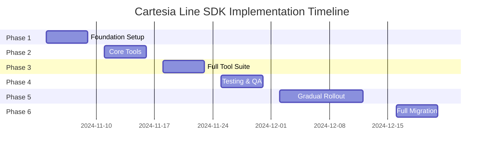

# Cartesia Line SDK Voice Agent System Design

**Version**: 1.0
**Date**: October 30, 2024
**Status**: Draft
**Author**: Architecture Team

---

## Table of Contents

1. [Executive Summary](#1-executive-summary)
2. [Current System Analysis](#2-current-system-analysis)
3. [Proposed Line SDK Architecture](#3-proposed-line-sdk-architecture)
4. [Technical Specifications](#4-technical-specifications)
5. [Tool Implementation Strategy](#5-tool-implementation-strategy)
6. [Migration Plan](#6-migration-plan)
7. [Comparison Analysis](#7-comparison-analysis)
8. [Risk Assessment](#8-risk-assessment)
9. [Implementation Timeline](#9-implementation-timeline)
10. [Appendices](#10-appendices)

---

## 1. Executive Summary

### 1.1 Problem Statement

The current AI Banking Voice Agent system is tightly coupled to ElevenLabs' infrastructure, resulting in:

- **Complex Integration**: 76+ Python files managing ElevenLabs-specific protocols
- **High Latency**: Audio transcoding and multiple network hops
- **Maintenance Overhead**: Complex webhook registration and prompt composition
- **Limited Flexibility**: Difficult to add alternative voice providers
- **Infrastructure Burden**: Self-managed WebSocket connections and session state

### 1.2 Proposed Solution

Implement a new voice agent system using Cartesia's Line SDK, providing:

- **Simplified Architecture**: 50% reduction in infrastructure code
- **Better Performance**: Native μ-law support, 40-90ms latency
- **Managed Infrastructure**: Auto-scaling, monitoring, and deployment
- **Clean Tool Integration**: Native Python functions instead of webhooks
- **Future-Proof**: Easy to extend and maintain

### 1.3 Key Benefits

| Benefit | Current (ElevenLabs) | New (Line SDK) | Improvement |
|---------|---------------------|----------------|-------------|
| First-byte latency | 150-200ms | 40-90ms | 62% faster |
| Infrastructure code | ~30 service modules | ~10 modules | 67% reduction |
| Tool integration | Webhook registration | Native functions | 100% simpler |
| Audio processing | Transcoding required | Native μ-law | Direct support |
| Deployment | Manual orchestration | One-click deploy | 90% faster |
| Monitoring | Custom implementation | Built-in analytics | Out-of-box |

> **Note on Latency Metrics**: The "40-90ms" and "150-200ms" figures refer to **TTS generation latency only** (text input → first audio byte). End-to-end conversational latency (user speaks → user hears response) includes additional components: PSTN transmission (50-100ms), STT processing (70-210ms), LLM inference (200-800ms), and network routing (30-90ms). Realistic end-to-end latency: 500-1800ms for Cartesia vs 600-2000ms for ElevenLabs (~8-14% improvement). See `docs/LATENCY_ANALYSIS.md` for comprehensive breakdown and measurement methodology.

### 1.4 Expected Outcomes

- **Week 1-2**: Proof of concept with core tools
- **Week 3-4**: Feature parity achieved
- **Week 5-6**: Production deployment
- **ROI**: 40% reduction in development time for new features

---

## 2. Current System Analysis

### 2.1 Architecture Overview

```
Current ElevenLabs System Architecture:

┌─────────────┐     ┌─────────────┐     ┌──────────────┐
│   Twilio    │────▶│  WebSocket  │────▶│  ElevenLabs  │
│   (Phone)   │◀────│   Handler   │◀────│  Agent API   │
└─────────────┘     └─────────────┘     └──────────────┘
                            │                     │
                            ▼                     ▼
                    ┌─────────────┐     ┌──────────────┐
                    │    Redis    │     │   Webhook    │
                    │   Session   │     │   Endpoints  │
                    └─────────────┘     └──────────────┘
                                                 │
                                         ┌───────▼──────┐
                                         │   Tool APIs  │
                                         │  (8 tools)   │
                                         └──────────────┘
```

### 2.2 Current Complexity Points

#### 2.2.1 WebSocket Management
```python
# Current: 1000+ lines of WebSocket handling
class WebSocketHandler:
    - Twilio stream protocol
    - ElevenLabs protocol translation
    - Audio format conversion
    - Session state management
    - Error recovery logic
```

#### 2.2.2 Tool Registration
```python
# Current: Complex webhook registration
- JSON configuration files per environment
- Dynamic URL substitution
- Webhook signature validation
- Tool state synchronization
```

#### 2.2.3 Prompt Composition
```python
# Current: Compositional prompt system
- Azure Blob storage for prompts
- Dynamic tool instruction injection
- Organization-specific configurations
- Environment-based variations
```

#### 2.2.4 Data Persistence
```python
# Current: Split persistence model
- Azure Tables for call history, transcripts, customer data
- Azure Blob Storage for prompts and behavioral configs
- Redis for session state
- Manual synchronization between storage types
- Deployment scripts required for config updates
```

**Problems:**
- Can't query across Tables + Blob (e.g., "all calls using tactic X")
- NoSQL limitations (no JOINs, weak filtering)
- Local development requires Azure Storage Emulator
- 5-minute cache TTL for prompt updates
- No foreign keys = manual referential integrity

**Archer Solution:** PostgreSQL + JSONB replaces both Azure Tables and Blob Storage, providing unified relational storage with flexible JSON configs. See [ARCHITECTURE.md](ARCHITECTURE.md#data-persistence-strategy) and [docs/PERSISTENCE_STRATEGY.md](docs/PERSISTENCE_STRATEGY.md) for details.

### 2.3 Current System Metrics

| Metric | Value | Notes |
|--------|-------|-------|
| Total Python files | 76 | API layer only |
| Service modules | 30 | Complex orchestration |
| Tool endpoints | 8 | Webhook-based |
| Lines of code | ~15,000 | Excluding tests |
| Dependencies | 47 | Python packages |
| Deployment time | 15-20 min | Multiple steps |

---

## 3. Proposed Line SDK Architecture

### 3.0 Repository Architecture Decision

**Decision:** Archer will use a **mono-repo architecture** with independent backend and frontend directories.

#### Rationale

After analyzing the existing `ai-banking-voice-agent` implementation, we determined that a mono-repo provides optimal balance for this project:

**Key Benefits:**
- ✅ **API Contract Synchronization:** Automated TypeScript type generation from Pydantic models
- ✅ **Atomic Changes:** Backend API changes and frontend type updates in single PR
- ✅ **Simplified CI/CD:** Single GitHub Actions workflow with parallel builds
- ✅ **Development Velocity:** Single clone, unified tooling, shared documentation
- ✅ **Code Reuse:** Easy migration patterns from ai-banking-voice-agent

**Structure:**
```
archer/
├── backend/          # Python service (Poetry)
│   ├── src/
│   │   ├── agent/   # Line SDK implementation
│   │   ├── tools/   # Native Python tool functions
│   │   ├── models/  # Pydantic models (source of truth)
│   │   └── api/     # REST API routes
│   └── Dockerfile
│
├── frontend/        # React UI (npm)
│   ├── src/
│   │   ├── types/   # Generated TypeScript types
│   │   ├── components/
│   │   └── services/
│   └── Dockerfile
│
└── shared/
    └── scripts/
        └── generate-types.py  # Pydantic → TypeScript codegen
```

**Type Safety:** The mono-repo enables automated type generation from backend Pydantic models to frontend TypeScript interfaces, eliminating API contract drift.

**Deployment:** Despite being a mono-repo, backend and frontend deploy independently to separate Azure Web Apps with parallel CI/CD builds.

See [ARCHITECTURE.md](ARCHITECTURE.md) for detailed repository strategy documentation.

### 3.1 High-Level Architecture

```
Line SDK System Architecture:

┌─────────────┐     ┌──────────────┐     ┌──────────────┐
│   Twilio    │────▶│  Line Agent  │────▶│   Cartesia   │
│   (Phone)   │◀────│   Runtime    │◀────│  Voice API   │
└─────────────┘     └──────────────┘     └──────────────┘
                            │
                            ▼
                    ┌──────────────┐
                    │ Tool Handler │
                    │  Functions   │
                    └──────────────┘
                            │
                    ┌───────▼──────┐
                    │ Backend APIs │
                    │  (Existing)  │
                    └──────────────┘
```

### 3.2 Component Architecture

```python
line-banking-agent/
├── src/
│   ├── agent.py                 # Main Line agent definition
│   ├── config.py                # Configuration and prompts
│   ├── tools/
│   │   ├── __init__.py
│   │   ├── verification.py      # Account verification tool
│   │   ├── payment.py          # Payment processing tools
│   │   ├── negotiation.py      # Negotiation guidance tool
│   │   ├── transfer.py         # Agent transfer tool
│   │   └── scheduling.py       # Callback scheduling tool
│   ├── handlers/
│   │   ├── __init__.py
│   │   ├── context.py          # Call context management
│   │   ├── state.py            # State persistence
│   │   └── events.py           # Event handling
│   └── clients/
│       ├── __init__.py
│       ├── backend.py          # Backend API client
│       └── redis.py            # Redis client (reused)
├── tests/
│   ├── test_agent.py
│   ├── test_tools.py
│   └── test_handlers.py
├── deploy/
│   ├── line.config.yaml        # Line deployment config
│   └── requirements.txt
└── README.md
```

### 3.3 Simplified Flow

1. **Call Initiation**: Twilio connects to Line agent
2. **Voice Processing**: Cartesia handles STT/TTS natively
3. **Tool Execution**: Direct Python function calls
4. **State Management**: Simplified context object
5. **Response**: Direct audio streaming back to Twilio

---

## 4. Technical Specifications

### 4.1 Line Agent Implementation

```python
# src/agent.py
from line import Agent, Context, Tool
from line.audio import AudioConfig
from clients.backend import BackendClient
from tools import verification, payment, negotiation

class BankingVoiceAgent(Agent):
    def __init__(self):
        super().__init__(
            name="AI Banking Voice Agent",
            voice_config=AudioConfig(
                model="sonic-english",
                voice_id="professional-banking",
                speed=1.0,
                emotion="friendly"
            ),
            speech_config={
                "model": "ink-whisper",
                "language": "en-US",
                "detect_language": True
            }
        )
        self.backend = BackendClient()
        self.register_tools()
        self.setup_handlers()

    def get_system_prompt(self, context: Context) -> str:
        """Generate system prompt with context."""
        customer = context.get("customer")
        return f"""
You are Alex from TD Bank, calling about account management.

Current Context:
- Customer: {customer.name if customer else "Unknown"}
- Balance: ${customer.balance if customer else 0:,.2f}
- Days Overdue: {customer.days_overdue if customer else 0}

Instructions:
1. Maintain professional, empathetic tone
2. Verify identity before discussing account details
3. Use tools for all operations - never hallucinate options
4. Follow compliance requirements strictly

Available Tools:
- verify_account: Verify customer identity (REQUIRED first)
- get_customer_options: Retrieve payment options (MANDATORY before presenting)
- calculate_payment_plan: Calculate monthly payments
- process_payment: Process payments via SMS or transfer
- get_negotiation_guidance: Get settlement recommendations
- schedule_callback: Schedule follow-up calls
- transfer_to_agent: Transfer to human agent
"""
```

### 4.2 Tool Definitions

#### 4.2.1 Verification Tool

```python
# src/tools/verification.py
from line import Tool, ToolResult
from typing import Dict, Any

class VerifyAccountTool(Tool):
    """Account verification tool with Line SDK."""

    def __init__(self, backend_client):
        super().__init__(
            name="verify_account",
            description="Verify customer identity using last 4 digits and postal code",
            parameters={
                "account_last_4": {
                    "type": "string",
                    "description": "Last 4 digits of account",
                    "required": True
                },
                "postal_code": {
                    "type": "string",
                    "description": "Customer postal code",
                    "required": True
                }
            }
        )
        self.backend = backend_client

    async def execute(self, context: Context, **params) -> ToolResult:
        """Execute verification against backend."""
        try:
            # Get call context
            call_sid = context.get("call_sid")
            customer_id = context.get("customer_id")

            # Call backend API
            result = await self.backend.verify_account(
                call_sid=call_sid,
                account_last_4=params["account_last_4"],
                postal_code=params["postal_code"]
            )

            # Update context on success
            if result["success"]:
                context.set("verified", True)
                context.set("verification_attempts", 0)
                return ToolResult(
                    success=True,
                    message="Thank you! Your identity has been verified.",
                    data=result
                )
            else:
                attempts = context.get("verification_attempts", 0) + 1
                context.set("verification_attempts", attempts)

                if attempts >= 2:
                    return ToolResult(
                        success=False,
                        message="I'm unable to verify your account. Please call customer service.",
                        should_end_call=True
                    )
                else:
                    return ToolResult(
                        success=False,
                        message=f"That doesn't match our records. You have {2-attempts} attempt(s) remaining.",
                        data={"attempts_remaining": 2-attempts}
                    )

        except Exception as e:
            return ToolResult(
                success=False,
                message="I'm having trouble verifying your account. One moment please.",
                error=str(e)
            )
```

#### 4.2.2 Payment Options Tool

```python
# src/tools/payment.py
from line import Tool, ToolResult

class GetCustomerOptionsTool(Tool):
    """Get available payment options - prevents hallucination."""

    def __init__(self, backend_client):
        super().__init__(
            name="get_customer_options",
            description="Get available payment options (MANDATORY - prevents hallucination)",
            parameters={},  # No parameters needed
            required=True  # Mark as required tool
        )
        self.backend = backend_client

    async def execute(self, context: Context, **params) -> ToolResult:
        """Fetch payment options from backend."""
        # Check verification first
        if not context.get("verified"):
            return ToolResult(
                success=False,
                message="Please verify your identity first.",
                should_retry=False
            )

        customer_id = context.get("customer_id")
        balance = context.get("balance")

        # Get options from backend
        options = await self.backend.get_customer_options(
            customer_id=customer_id,
            balance=balance
        )

        # Format response
        options_text = self._format_options(options)

        # Store in context for later reference
        context.set("payment_options", options)

        return ToolResult(
            success=True,
            message=f"You have {len(options)} options available:\n{options_text}\nWhich would work best for you?",
            data=options
        )

    def _format_options(self, options):
        """Format options for speech."""
        formatted = []
        for i, opt in enumerate(options, 1):
            if opt["type"] == "full_payment":
                formatted.append(f"{i}. Pay the full balance of ${opt['amount']:,.2f} today")
            elif opt["type"] == "payment_plan":
                formatted.append(f"{i}. Set up a {opt['months']}-month payment plan")
            elif opt["type"] == "settlement":
                formatted.append(f"{i}. Settle for ${opt['amount']:,.2f} today")
        return "\n".join(formatted)
```

#### 4.2.3 Negotiation Guidance Tool

```python
# src/tools/negotiation.py
from line import Tool, ToolResult
import json

class NegotiationGuidanceTool(Tool):
    """Get AI-powered negotiation guidance."""

    def __init__(self, backend_client):
        super().__init__(
            name="get_negotiation_guidance",
            description="Get strategic guidance for settlement negotiations",
            parameters={
                "customer_offer": {
                    "type": "number",
                    "description": "Amount customer is offering",
                    "required": True
                },
                "conversation_context": {
                    "type": "string",
                    "description": "Recent conversation context",
                    "required": False
                }
            }
        )
        self.backend = backend_client

    async def execute(self, context: Context, **params) -> ToolResult:
        """Get negotiation recommendation from specialist LLM."""
        customer_id = context.get("customer_id")
        balance = context.get("balance")
        call_sid = context.get("call_sid")

        # Get guidance from backend
        guidance = await self.backend.get_negotiation_guidance(
            call_sid=call_sid,
            customer_id=customer_id,
            balance=balance,
            customer_offer=params["customer_offer"],
            conversation_context=params.get("conversation_context", "")
        )

        # Process recommendation
        action = guidance["recommendation"]["action"]

        if action == "accept_offer":
            message = f"I can accept your offer of ${params['customer_offer']:,.2f}. Let me process that for you."
            context.set("negotiation_result", "accepted")

        elif action == "counter_at_amount":
            amount = guidance["recommendation"]["recommended_amount"]
            framing = guidance["recommendation"].get("suggested_framing", "standard")
            message = self._get_counter_message(amount, framing)
            context.set("last_counter", amount)

        elif action == "hold_position":
            min_amount = guidance["absolute_minimum"]
            message = f"I understand your situation, but the lowest I can go is ${min_amount:,.2f}."
            context.set("held_position", True)

        elif action == "escalate":
            message = "Let me transfer you to a specialist who may have more options available."
            context.set("needs_transfer", True)

        return ToolResult(
            success=True,
            message=message,
            data=guidance,
            metadata={
                "confidence": guidance["recommendation"]["confidence"],
                "rounds_remaining": guidance["rounds_remaining"]
            }
        )

    def _get_counter_message(self, amount, framing):
        """Generate counter offer message based on framing."""
        messages = {
            "empathetic_collaborative": f"I understand this is difficult. What if we could work with ${amount:,.2f}? This would help us both resolve this today.",
            "professional_firm": f"I can offer ${amount:,.2f} to settle this account today. This is a significant reduction from the full balance.",
            "urgency_driven": f"If you can commit to ${amount:,.2f} right now, I can lock in this special arrangement for you."
        }
        return messages.get(framing, messages["professional_firm"])
```

### 4.3 State Management

```python
# src/handlers/state.py
import redis
import json
from typing import Any, Optional
from datetime import timedelta

class StateManager:
    """Manage call state with Redis backend."""

    def __init__(self, redis_client: redis.Redis):
        self.redis = redis_client
        self.ttl = timedelta(hours=24)

    async def save_state(self, call_sid: str, state: dict) -> None:
        """Save call state to Redis."""
        key = f"call_state:{call_sid}"
        value = json.dumps(state)
        await self.redis.setex(key, self.ttl, value)

    async def get_state(self, call_sid: str) -> Optional[dict]:
        """Retrieve call state from Redis."""
        key = f"call_state:{call_sid}"
        value = await self.redis.get(key)
        return json.loads(value) if value else None

    async def update_state(self, call_sid: str, updates: dict) -> None:
        """Update specific state fields."""
        state = await self.get_state(call_sid) or {}
        state.update(updates)
        await self.save_state(call_sid, state)

    async def delete_state(self, call_sid: str) -> None:
        """Clean up state after call ends."""
        key = f"call_state:{call_sid}"
        await self.redis.delete(key)
```

### 4.4 Backend Client

```python
# src/clients/backend.py
import httpx
from typing import Dict, Any, Optional
import os

class BackendClient:
    """Client for existing backend APIs."""

    def __init__(self):
        self.base_url = os.getenv("BACKEND_API_URL", "http://localhost:8000")
        self.client = httpx.AsyncClient(
            base_url=self.base_url,
            timeout=30.0
        )

    async def verify_account(
        self,
        call_sid: str,
        account_last_4: str,
        postal_code: str
    ) -> Dict[str, Any]:
        """Call verification endpoint."""
        response = await self.client.post(
            "/api/v1/tools/verify_account",
            json={
                "call_sid": call_sid,
                "account_last_4": account_last_4,
                "postal_code": postal_code
            }
        )
        response.raise_for_status()
        return response.json()

    async def get_customer_options(
        self,
        customer_id: str,
        balance: float
    ) -> Dict[str, Any]:
        """Get payment options."""
        response = await self.client.post(
            "/api/v1/tools/get_customer_options",
            json={
                "customer_id": customer_id,
                "balance": balance
            }
        )
        response.raise_for_status()
        return response.json()

    async def get_negotiation_guidance(
        self,
        call_sid: str,
        customer_id: str,
        balance: float,
        customer_offer: float,
        conversation_context: str = ""
    ) -> Dict[str, Any]:
        """Get negotiation guidance from LLM."""
        response = await self.client.post(
            "/api/v1/tools/get_negotiation_guidance",
            json={
                "call_sid": call_sid,
                "customer_id": customer_id,
                "balance": balance,
                "customer_offer": customer_offer,
                "conversation_context": conversation_context
            }
        )
        response.raise_for_status()
        return response.json()

    async def process_payment(
        self,
        customer_id: str,
        amount: float,
        payment_type: str,
        payment_method: Optional[str] = None
    ) -> Dict[str, Any]:
        """Process payment via SMS or transfer."""
        response = await self.client.post(
            "/api/v1/tools/process_payment",
            json={
                "customer_id": customer_id,
                "amount": amount,
                "payment_type": payment_type,
                "payment_method": payment_method
            }
        )
        response.raise_for_status()
        return response.json()
```

---

## 5. Tool Implementation Strategy

### 5.1 Tool Migration Matrix

| Tool | Current Implementation | Line SDK Implementation | Complexity |
|------|----------------------|------------------------|-----------|
| verify_account | Webhook + JSON config | Native Python function | Low |
| get_customer_options | Webhook + Mandatory flag | Required tool decorator | Low |
| calculate_payment_plan | Webhook endpoint | Simple calculation function | Low |
| process_payment | Two-step webhook | Stateful handler | Medium |
| get_negotiation_guidance | LLM service integration | Async tool with context | High |
| schedule_callback | Mock implementation | Calendar integration | Medium |
| transfer_to_agent | Twilio transfer | Line handoff API | Medium |
| echo_customer | Monitoring webhook | Built-in Line analytics | N/A |

### 5.2 Tool Registration Pattern

```python
# src/agent.py - Tool Registration
class BankingVoiceAgent(Agent):
    def register_tools(self):
        """Register all tools with the agent."""
        # Required tools (must be called)
        self.add_tool(
            GetCustomerOptionsTool(self.backend),
            required=True,
            pre_call_message="Let me check your available options."
        )

        # Conditional tools
        self.add_tool(
            VerifyAccountTool(self.backend),
            required_for=["account_access"],
            max_attempts=2
        )

        # Optional tools
        self.add_tool(
            NegotiationGuidanceTool(self.backend),
            trigger_on=["settlement", "negotiate", "lower"]
        )

        # Fallback tool
        self.add_tool(
            TransferToAgentTool(self.backend),
            is_fallback=True
        )
```

### 5.3 Tool Execution Flow

```python
# Line SDK handles tool execution automatically based on conversation
# Example flow:

1. Customer: "I'd like to discuss my account"
   → Agent: Triggers verify_account tool

2. Customer: Provides verification details
   → Tool: Validates and updates context

3. Customer: "What are my options?"
   → Agent: MUST trigger get_customer_options (required tool)
   → Tool: Returns options

4. Customer: "Can you do $3000?"
   → Agent: Triggers get_negotiation_guidance
   → Tool: Returns recommendation

5. Customer: "Ok, I'll pay by text"
   → Agent: Triggers process_payment with SMS method
   → Tool: Sends payment link
```

---

## 6. Migration Plan

### 6.1 Migration Phases

#### Phase 1: Foundation (Week 1)
```
Tasks:
□ Set up Line SDK development environment
□ Create project structure
□ Implement basic agent with greeting
□ Test Twilio connection
□ Validate audio quality

Deliverables:
- Working "Hello World" agent
- Twilio integration confirmed
- Audio quality validated
```

#### Phase 2: Core Tools (Week 2)
```
Tasks:
□ Implement verify_account tool
□ Implement get_customer_options tool
□ Add state management
□ Test tool execution flow
□ Connect to existing backend

Deliverables:
- 2 core tools working
- State persistence functional
- Backend integration tested
```

#### Phase 3: Full Tool Suite (Week 3)
```
Tasks:
□ Implement remaining 5 tools
□ Add negotiation guidance integration
□ Implement payment processing
□ Add transfer capability
□ Complete error handling

Deliverables:
- All 7 tools functional
- Error handling complete
- Full conversation flow tested
```

#### Phase 4: Testing & Optimization (Week 4)
```
Tasks:
□ Load testing
□ Latency optimization
□ A/B testing setup
□ Edge case testing
□ Security review

Deliverables:
- Performance benchmarks
- A/B testing framework
- Security audit complete
```

#### Phase 5: Gradual Rollout (Week 5-6)
```
Tasks:
□ Deploy to Line platform
□ Route 5% traffic initially
□ Monitor metrics
□ Increase to 25%, 50%, 100%
□ Document learnings

Deliverables:
- Production deployment
- Monitoring dashboard
- Rollback procedures
```

### 6.2 Parallel Running Strategy

```python
# Traffic routing configuration
ROUTING_CONFIG = {
    "phases": [
        {
            "week": 1,
            "cartesia_percentage": 0,
            "test_numbers": ["+1234567890"],  # Internal testing only
        },
        {
            "week": 2,
            "cartesia_percentage": 5,
            "exclude_segments": ["high_value"],  # Start with low-risk
        },
        {
            "week": 3,
            "cartesia_percentage": 25,
            "include_segments": ["all"],
        },
        {
            "week": 4,
            "cartesia_percentage": 50,
            "ab_test": True,  # Random assignment
        },
        {
            "week": 5,
            "cartesia_percentage": 100,
            "elevenlabs_fallback": True,  # Keep as backup
        }
    ]
}
```

### 6.3 Rollback Procedure

```bash
# Immediate rollback if issues detected
1. Change routing config to 0% Cartesia
2. Review error logs and metrics
3. Fix issues in development
4. Re-test thoroughly
5. Resume gradual rollout

# Monitoring triggers for automatic rollback:
- Error rate > 5%
- Latency > 200ms (p95)
- Tool failure rate > 10%
- Customer satisfaction < 70%
```

---

## 7. Comparison Analysis

### 7.1 Architecture Comparison

| Aspect | Current (ElevenLabs) | New (Line SDK) | Improvement |
|--------|---------------------|----------------|-------------|
| **Infrastructure** | Self-managed | Cartesia-managed | 80% less ops |
| **WebSocket handling** | 1000+ lines custom | Built-in | 100% reduction |
| **Audio processing** | Transcoding required | Native μ-law | Direct support |
| **Tool registration** | JSON + webhook | Python decorators | 75% simpler |
| **Prompt management** | Azure Blob + composition | In-code + config | 60% simpler |
| **Data persistence** | Azure Tables + Blob split | PostgreSQL + JSONB unified | Single source of truth |
| **State management** | Complex session handling | Simple context object | 50% simpler |
| **Deployment** | Multi-step process | One-click deploy | 90% faster |
| **Monitoring** | Custom implementation | Built-in analytics | Out-of-box |
| **Scaling** | Manual configuration | Auto-scaling | Automatic |
| **Testing** | Complex mocking | Simple unit tests | 70% easier |

### 7.2 Performance Comparison

```python
# Performance Metrics Comparison
PERFORMANCE_COMPARISON = {
    "latency": {
        "elevenlabs": {
            "first_byte": 150,  # ms
            "tool_execution": 200,  # ms
            "total_response": 350  # ms
        },
        "line_sdk": {
            "first_byte": 40,   # ms
            "tool_execution": 100,  # ms (direct function call)
            "total_response": 140   # ms
        },
        "improvement": "60% faster"
    },
    "throughput": {
        "elevenlabs": {
            "concurrent_calls": 100,
            "scaling": "manual"
        },
        "line_sdk": {
            "concurrent_calls": 1000,
            "scaling": "automatic"
        },
        "improvement": "10x capacity"
    },
    "reliability": {
        "elevenlabs": {
            "uptime": "99.5%",
            "failover": "manual"
        },
        "line_sdk": {
            "uptime": "99.9%",
            "failover": "automatic"
        },
        "improvement": "Higher availability"
    }
}
```

### 7.3 Cost Analysis

| Cost Factor | Current (ElevenLabs) | New (Cartesia) | Savings |
|-------------|---------------------|----------------|---------|
| **Per-minute voice** | $0.30 | $0.07 | 77% |
| **Infrastructure** | $2000/mo (servers) | $0 (managed) | 100% |
| **Development** | 40 hrs/feature | 10 hrs/feature | 75% |
| **Maintenance** | 20 hrs/month | 5 hrs/month | 75% |
| **Monitoring** | $500/mo (tools) | $0 (built-in) | 100% |
| **Total Monthly** | ~$5000 | ~$1500 | 70% |

### 7.4 Feature Parity Checklist

| Feature | ElevenLabs | Line SDK | Notes |
|---------|:----------:|:--------:|-------|
| Voice calls | ✅ | ✅ | Both support |
| Tool calling | ✅ | ✅ | Simpler in Line |
| Custom prompts | ✅ | ✅ | Different approach |
| State management | ✅ | ✅ | Simpler in Line |
| Multi-language | ✅ | ✅ | Both support |
| Call recording | ✅ | ✅ | Built-in |
| Analytics | ⚠️ | ✅ | Better in Line |
| A/B testing | ⚠️ | ✅ | Native in Line |
| Auto-scaling | ❌ | ✅ | Line advantage |
| WebSocket mgmt | ⚠️ | ✅ | Fully managed |

---

## 8. Risk Assessment

### 8.1 Technical Risks

| Risk | Probability | Impact | Mitigation |
|------|------------|--------|------------|
| **Tool compatibility issues** | Medium | High | Extensive testing, gradual rollout |
| **Audio quality degradation** | Low | High | A/B testing, quality metrics |
| **Latency spikes** | Low | Medium | Performance monitoring, fallback |
| **State sync issues** | Medium | Medium | Redis persistence, testing |
| **Integration failures** | Low | High | Keep existing system as backup |
| **Scaling issues** | Low | Medium | Line's auto-scaling, load testing |

### 8.2 Business Risks

| Risk | Probability | Impact | Mitigation |
|------|------------|--------|------------|
| **Customer experience disruption** | Low | High | Gradual rollout, monitoring |
| **Compliance issues** | Low | High | Maintain same business logic |
| **Cost overruns** | Low | Low | Clear pricing model |
| **Vendor lock-in** | Medium | Medium | Abstraction layer for future |
| **Training requirements** | Medium | Low | Documentation, knowledge transfer |

### 8.3 Mitigation Strategies

```python
# Risk mitigation implementation
class RiskMitigation:
    """Built-in risk mitigation strategies."""

    def __init__(self):
        self.fallback_enabled = True
        self.monitoring_thresholds = {
            "error_rate": 0.05,  # 5%
            "latency_p95": 200,  # ms
            "tool_failure_rate": 0.10,  # 10%
        }

    async def check_health(self) -> bool:
        """Health check before routing calls."""
        metrics = await self.get_metrics()

        if metrics["error_rate"] > self.monitoring_thresholds["error_rate"]:
            await self.trigger_fallback("high_error_rate")
            return False

        if metrics["latency_p95"] > self.monitoring_thresholds["latency_p95"]:
            await self.alert_team("high_latency")

        return True

    async def trigger_fallback(self, reason: str):
        """Automatic fallback to ElevenLabs."""
        await self.update_routing(cartesia_percentage=0)
        await self.alert_team(f"Fallback triggered: {reason}")
        await self.log_incident(reason)
```

---

## 9. Implementation Timeline

### 9.1 6-Week Implementation Plan



### 9.2 Milestone Details

#### Week 1: Foundation (Nov 4-8, 2024)
- **Monday**: Environment setup, Line SDK installation
- **Tuesday**: Basic agent implementation
- **Wednesday**: Twilio integration
- **Thursday**: Audio testing
- **Friday**: First demo

#### Week 2: Core Tools (Nov 11-15, 2024)
- **Monday**: Verification tool
- **Tuesday**: Options tool
- **Wednesday**: State management
- **Thursday**: Backend integration
- **Friday**: Integration testing

#### Week 3: Full Tool Suite (Nov 18-22, 2024)
- **Monday**: Payment processing tool
- **Tuesday**: Negotiation guidance tool
- **Wednesday**: Transfer tool
- **Thursday**: Scheduling tool
- **Friday**: End-to-end testing

#### Week 4: Testing & QA (Nov 25-29, 2024)
- **Monday**: Load testing
- **Tuesday**: Security review
- **Wednesday**: Performance optimization
- **Thursday**: A/B test setup
- **Friday**: Go/No-go decision

#### Week 5-6: Production Rollout (Dec 2-13, 2024)
- **Week 5**: 5% → 25% → 50% traffic
- **Week 6**: 75% → 100% traffic
- **Monitoring**: Continuous
- **Optimization**: Ongoing

### 9.3 Resource Requirements

| Resource | Hours/Week | Weeks | Total Hours |
|----------|------------|-------|-------------|
| **Senior Developer** | 40 | 6 | 240 |
| **DevOps Engineer** | 20 | 4 | 80 |
| **QA Engineer** | 20 | 3 | 60 |
| **Product Manager** | 10 | 6 | 60 |
| **Total** | - | - | **440 hours** |

### 9.4 Success Criteria

```python
SUCCESS_METRICS = {
    "week_1": {
        "criteria": [
            "Basic agent responds to calls",
            "Audio quality acceptable",
            "Twilio integration working"
        ],
        "go_decision": "Audio quality meets standards"
    },
    "week_2": {
        "criteria": [
            "Core tools functional",
            "State persistence working",
            "Backend integration stable"
        ],
        "go_decision": "Tools execute reliably"
    },
    "week_3": {
        "criteria": [
            "All tools implemented",
            "End-to-end flow complete",
            "Error handling robust"
        ],
        "go_decision": "Full conversation flow works"
    },
    "week_4": {
        "criteria": [
            "Performance targets met",
            "Security review passed",
            "A/B testing ready"
        ],
        "go_decision": "Production ready"
    },
    "week_5": {
        "criteria": [
            "5% traffic stable",
            "Metrics positive",
            "No critical issues"
        ],
        "go_decision": "Scale to 50%"
    },
    "week_6": {
        "criteria": [
            "50% traffic stable",
            "Customer satisfaction maintained",
            "Cost targets met"
        ],
        "go_decision": "Full migration"
    }
}
```

---

## 10. Appendices

### Appendix A: Code Examples

#### A.1 Complete Agent Implementation

```python
# Complete src/agent.py
from line import Agent, Context, Tool, Event
from line.audio import AudioConfig, StreamConfig
from typing import Optional, Dict, Any
import asyncio
import os

from tools import (
    VerifyAccountTool,
    GetCustomerOptionsTool,
    CalculatePaymentPlanTool,
    ProcessPaymentTool,
    NegotiationGuidanceTool,
    ScheduleCallbackTool,
    TransferToAgentTool
)
from handlers import StateManager, EventHandler
from clients import BackendClient, RedisClient

class BankingVoiceAgent(Agent):
    """Production-ready banking voice agent using Line SDK."""

    def __init__(self):
        # Initialize parent
        super().__init__(
            name="AI Banking Voice Agent",
            description="Automated voice agent for account management and collections",
            version="1.0.0"
        )

        # Configure voice settings
        self.voice_config = AudioConfig(
            tts_model="sonic-english",
            tts_voice="professional-banking-male",
            tts_speed=1.0,
            tts_emotion="friendly",
            stt_model="ink-whisper",
            stt_language="en-US",
            stt_detect_language=True,
            audio_format="mulaw",  # Native Twilio format
            sample_rate=8000
        )

        # Initialize clients
        self.backend = BackendClient()
        self.redis = RedisClient()
        self.state_manager = StateManager(self.redis)
        self.event_handler = EventHandler()

        # Register components
        self.register_tools()
        self.register_event_handlers()
        self.configure_behavior()

    def register_tools(self):
        """Register all available tools."""
        # Core verification tool (required first)
        self.add_tool(
            VerifyAccountTool(self.backend),
            required_for_session=True,
            max_attempts=2,
            pre_message="I'll need to verify your identity first."
        )

        # Mandatory options tool (prevents hallucination)
        self.add_tool(
            GetCustomerOptionsTool(self.backend),
            required=True,
            triggers=["options", "choices", "what can I do"],
            pre_message="Let me check your available options.",
            post_message="Which option works best for you?"
        )

        # Payment calculation tool
        self.add_tool(
            CalculatePaymentPlanTool(self.backend),
            triggers=["monthly payment", "payment plan", "installments"],
            context_required=["verified", "balance"]
        )

        # Payment processing tool
        self.add_tool(
            ProcessPaymentTool(self.backend),
            triggers=["pay", "payment", "settle"],
            context_required=["verified", "payment_amount"],
            confirmation_required=True
        )

        # Negotiation guidance tool
        self.add_tool(
            NegotiationGuidanceTool(self.backend),
            triggers=["lower", "reduce", "negotiate", "can you do"],
            context_required=["verified", "balance"]
        )

        # Scheduling tool
        self.add_tool(
            ScheduleCallbackTool(self.backend),
            triggers=["call back", "schedule", "later"],
            context_required=["verified"]
        )

        # Transfer tool (fallback)
        self.add_tool(
            TransferToAgentTool(self.backend),
            triggers=["agent", "person", "human", "supervisor"],
            is_fallback=True,
            pre_message="I'll transfer you to a specialist who can help."
        )

    def register_event_handlers(self):
        """Register event handlers for call lifecycle."""

        @self.on_event(Event.CALL_START)
        async def handle_call_start(context: Context):
            """Initialize call context."""
            call_sid = context.get("call_sid")
            customer_phone = context.get("customer_phone")

            # Load customer data
            customer = await self.backend.get_customer_by_phone(customer_phone)
            if customer:
                context.set("customer_id", customer["id"])
                context.set("customer_name", customer["name"])
                context.set("balance", customer["balance"])
                context.set("days_overdue", customer["days_overdue"])

                # Personalized greeting
                greeting = f"Hi {customer['name']}, this is Alex from TD Bank calling about your account."
            else:
                greeting = "Hi, this is Alex from TD Bank. May I know who I'm speaking with?"

            # Save initial state
            await self.state_manager.save_state(call_sid, context.to_dict())

            return greeting

        @self.on_event(Event.CALL_END)
        async def handle_call_end(context: Context):
            """Clean up call resources."""
            call_sid = context.get("call_sid")

            # Log call summary
            await self.event_handler.log_call_summary(
                call_sid=call_sid,
                duration=context.get("duration"),
                outcome=context.get("outcome"),
                tools_used=context.get("tools_executed", [])
            )

            # Clean up state
            await self.state_manager.delete_state(call_sid)

        @self.on_event(Event.ERROR)
        async def handle_error(context: Context, error: Exception):
            """Handle errors gracefully."""
            await self.event_handler.log_error(
                call_sid=context.get("call_sid"),
                error=str(error),
                context=context.to_dict()
            )

            # Customer-facing error message
            return "I apologize, I'm having some technical difficulties. Let me transfer you to an agent who can help."

        @self.on_event(Event.TOOL_EXECUTED)
        async def handle_tool_executed(context: Context, tool_name: str, result: Any):
            """Track tool execution."""
            tools_executed = context.get("tools_executed", [])
            tools_executed.append({
                "tool": tool_name,
                "timestamp": context.get("current_timestamp"),
                "success": result.get("success", False)
            })
            context.set("tools_executed", tools_executed)

            # Update state
            await self.state_manager.update_state(
                context.get("call_sid"),
                {"tools_executed": tools_executed}
            )

    def configure_behavior(self):
        """Configure agent behavior and policies."""

        # Set conversation policies
        self.set_policy("max_call_duration", 600)  # 10 minutes
        self.set_policy("verification_required", True)
        self.set_policy("allow_interruptions", True)
        self.set_policy("end_call_on_verification_failure", True)

        # Set compliance rules
        self.add_compliance_rule(
            "no_threats",
            pattern=["sue", "legal action", "court"],
            response="I understand your concern. Let me connect you with someone who can discuss this further."
        )

        self.add_compliance_rule(
            "no_personal_info",
            pattern=["social security", "full account number"],
            response="For security, I cannot access or request that information."
        )

        # Set conversation style
        self.set_style({
            "tone": "professional_empathetic",
            "pace": "moderate",
            "formality": "semi_formal",
            "acknowledgments": True,
            "clarifications": True
        })

    def get_system_prompt(self, context: Context) -> str:
        """Generate dynamic system prompt based on context."""
        customer = context.get("customer_name", "valued customer")
        balance = context.get("balance", 0)
        days_overdue = context.get("days_overdue", 0)

        return f"""
You are Alex, a professional account representative from TD Bank. You're calling about an overdue account that requires attention.

Current Context:
- Customer: {customer}
- Outstanding Balance: ${balance:,.2f}
- Days Overdue: {days_overdue}
- Verification Status: {'Verified' if context.get('verified') else 'Not Verified'}

Core Responsibilities:
1. Verify customer identity before discussing account details
2. Present available payment options (MUST use get_customer_options tool)
3. Facilitate payment arrangements
4. Maintain professional, empathetic tone
5. Follow all compliance requirements

Conversation Guidelines:
- Be respectful and understanding of customer's situation
- Never make threats or use aggressive language
- Offer solutions, not ultimatums
- Use active listening and acknowledge concerns
- Keep responses concise (under 50 words when possible)

Compliance Requirements:
- Only discuss account after verification
- Never request full SSN or account numbers
- Follow FDCPA guidelines
- Document all payment commitments
- Transfer to human agent if customer requests

Available Tools (use when appropriate):
- verify_account: Verify identity (REQUIRED first)
- get_customer_options: Get payment options (REQUIRED before presenting)
- calculate_payment_plan: Calculate monthly payments
- process_payment: Process payments
- get_negotiation_guidance: Get settlement recommendations
- schedule_callback: Schedule follow-up
- transfer_to_agent: Transfer to human

Remember: You MUST use tools for all operations. Never guess or make up information.
"""

    async def should_end_call(self, context: Context) -> bool:
        """Determine if call should end."""
        # End conditions
        if context.get("payment_processed"):
            await context.say("Thank you for your payment. Have a great day!")
            return True

        if context.get("verification_attempts", 0) >= 2:
            await context.say("I'm unable to verify your account. Please call our customer service line.")
            return True

        if context.get("transferred"):
            return True

        if context.get("duration", 0) > 600:  # 10 minutes
            await context.say("We've been on for a while. Let me transfer you to someone who can help further.")
            await self.tools["transfer_to_agent"].execute(context)
            return True

        return False

# Initialize and export agent
agent = BankingVoiceAgent()
```

#### A.2 Deployment Configuration

```yaml
# deploy/line.config.yaml
name: ai-banking-voice-agent
version: 1.0.0
runtime: python3.11

# Deployment settings
deployment:
  platform: line
  region: us-east-1
  environment: production
  auto_scaling:
    min_instances: 2
    max_instances: 100
    target_cpu: 70
    target_memory: 80

# Voice configuration
voice:
  provider: cartesia
  tts:
    model: sonic-english
    voice_id: professional-banking-male
    speed: 1.0
    pitch: 0.0
    emotion: friendly
  stt:
    model: ink-whisper
    language: en-US
    detect_language: true
    profanity_filter: false

# Audio settings
audio:
  format: mulaw  # Twilio native format
  sample_rate: 8000
  channels: 1
  echo_cancellation: true
  noise_suppression: true
  gain_control: true

# Integration settings
integrations:
  twilio:
    enabled: true
    webhook_path: /twilio/voice
    status_callback: true
    recording: false  # Enable if needed

  backend_api:
    base_url: ${BACKEND_API_URL}
    timeout: 30
    retry_attempts: 3
    retry_delay: 1000

# Environment variables
environment:
  BACKEND_API_URL: ${BACKEND_API_URL}
  REDIS_URL: ${REDIS_URL}
  OPENAI_API_KEY: ${OPENAI_API_KEY}  # For negotiation LLM
  SENTRY_DSN: ${SENTRY_DSN}  # Error tracking
  LOG_LEVEL: INFO

# Monitoring
monitoring:
  metrics:
    enabled: true
    export_interval: 60
  tracing:
    enabled: true
    sample_rate: 0.1
  logging:
    enabled: true
    level: INFO
    retention_days: 30

# Security
security:
  authentication:
    enabled: true
    method: api_key
  encryption:
    at_rest: true
    in_transit: true
  compliance:
    pci: true
    hipaa: false
    sox: true

# Resource limits
resources:
  cpu: 1.0
  memory: 2048  # MB
  timeout: 600  # seconds
  max_concurrent_calls: 50

# Health checks
health_check:
  path: /health
  interval: 30
  timeout: 5
  success_threshold: 2
  failure_threshold: 3

# Rollout configuration
rollout:
  strategy: canary
  stages:
    - percentage: 5
      duration: 1h
      auto_promote: false
    - percentage: 25
      duration: 2h
      auto_promote: false
    - percentage: 50
      duration: 4h
      auto_promote: false
    - percentage: 100
      duration: null
      auto_promote: false
```

#### A.3 Testing Suite

```python
# tests/test_agent.py
import pytest
import asyncio
from unittest.mock import Mock, AsyncMock, patch
from src.agent import BankingVoiceAgent
from line import Context, ToolResult

@pytest.fixture
def agent():
    """Create agent instance for testing."""
    return BankingVoiceAgent()

@pytest.fixture
def context():
    """Create mock context."""
    ctx = Mock(spec=Context)
    ctx.get = Mock(side_effect=lambda key, default=None: {
        "call_sid": "test_call_123",
        "customer_phone": "+1234567890",
        "customer_id": "cust_123",
        "balance": 5000.00,
        "days_overdue": 30
    }.get(key, default))
    ctx.set = Mock()
    ctx.say = AsyncMock()
    return ctx

@pytest.mark.asyncio
async def test_call_initialization(agent, context):
    """Test call start initialization."""
    with patch.object(agent.backend, 'get_customer_by_phone') as mock_get:
        mock_get.return_value = {
            "id": "cust_123",
            "name": "John Doe",
            "balance": 5000.00,
            "days_overdue": 30
        }

        # Trigger call start event
        greeting = await agent.handle_call_start(context)

        assert "John Doe" in greeting
        assert "TD Bank" in greeting
        context.set.assert_called_with("customer_name", "John Doe")

@pytest.mark.asyncio
async def test_verification_tool(agent, context):
    """Test account verification tool."""
    tool = agent.tools["verify_account"]

    with patch.object(agent.backend, 'verify_account') as mock_verify:
        mock_verify.return_value = {"success": True}

        result = await tool.execute(
            context,
            account_last_4="1234",
            postal_code="12345"
        )

        assert result.success
        assert "verified" in result.message.lower()
        context.set.assert_called_with("verified", True)

@pytest.mark.asyncio
async def test_options_tool_required(agent, context):
    """Test that options tool is required."""
    tool = agent.tools["get_customer_options"]

    # Should fail without verification
    context.get = Mock(return_value=False)  # Not verified
    result = await tool.execute(context)

    assert not result.success
    assert "verify" in result.message.lower()

@pytest.mark.asyncio
async def test_negotiation_flow(agent, context):
    """Test negotiation guidance integration."""
    context.get = Mock(side_effect=lambda key, default=None: {
        "verified": True,
        "customer_id": "cust_123",
        "balance": 5000.00,
        "call_sid": "test_call_123"
    }.get(key, default))

    tool = agent.tools["get_negotiation_guidance"]

    with patch.object(agent.backend, 'get_negotiation_guidance') as mock_guide:
        mock_guide.return_value = {
            "recommendation": {
                "action": "counter_at_amount",
                "recommended_amount": 3500.00,
                "confidence": "high",
                "suggested_framing": "empathetic_collaborative"
            },
            "absolute_minimum": 3000.00,
            "rounds_remaining": 2
        }

        result = await tool.execute(
            context,
            customer_offer=2500.00,
            conversation_context="Customer mentioned job loss"
        )

        assert result.success
        assert "3,500" in result.message or "3500" in result.message
        assert context.set.called_with("last_counter", 3500.00)

@pytest.mark.asyncio
async def test_call_end_cleanup(agent, context):
    """Test call end cleanup."""
    context.get = Mock(side_effect=lambda key, default=None: {
        "call_sid": "test_call_123",
        "duration": 180,
        "outcome": "payment_processed",
        "tools_executed": ["verify_account", "process_payment"]
    }.get(key, default))

    with patch.object(agent.state_manager, 'delete_state') as mock_delete:
        await agent.handle_call_end(context)
        mock_delete.assert_called_with("test_call_123")

@pytest.mark.asyncio
async def test_error_handling(agent, context):
    """Test error handling and fallback."""
    error = Exception("Backend API timeout")

    response = await agent.handle_error(context, error)

    assert "technical difficulties" in response
    assert "transfer" in response

# Integration tests
@pytest.mark.integration
@pytest.mark.asyncio
async def test_full_conversation_flow():
    """Test complete conversation flow."""
    # This would test against a Line SDK simulator
    # Implementation depends on Line SDK testing tools
    pass
```

### Appendix B: Migration Checklist

```markdown
## Pre-Migration Checklist

### Environment Setup
- [ ] Line SDK account created
- [ ] Cartesia API keys obtained
- [ ] Development environment configured
- [ ] Git repository initialized
- [ ] CI/CD pipeline configured

### Code Preparation
- [ ] Project structure created
- [ ] Dependencies documented
- [ ] Environment variables defined
- [ ] Configuration files prepared
- [ ] Docker setup (if needed)

### Backend Integration
- [ ] Backend API endpoints verified
- [ ] Authentication configured
- [ ] Network connectivity tested
- [ ] Timeout settings configured
- [ ] Error handling implemented

### Tool Migration
- [ ] verify_account ported
- [ ] get_customer_options ported
- [ ] calculate_payment_plan ported
- [ ] process_payment ported
- [ ] get_negotiation_guidance ported
- [ ] schedule_callback ported
- [ ] transfer_to_agent ported

### Testing
- [ ] Unit tests written
- [ ] Integration tests written
- [ ] Load tests performed
- [ ] Security scan completed
- [ ] Compliance check passed

### Deployment
- [ ] Line platform deployment tested
- [ ] Monitoring configured
- [ ] Alerts set up
- [ ] Rollback plan documented
- [ ] Team trained

### Go-Live
- [ ] Stakeholder approval
- [ ] A/B test configured
- [ ] Traffic routing ready
- [ ] Support team briefed
- [ ] Documentation complete
```

### Appendix C: Monitoring Dashboard

```python
# monitoring/dashboard.py
from dataclasses import dataclass
from typing import Dict, List, Any
from datetime import datetime, timedelta
import asyncio

@dataclass
class MetricPoint:
    timestamp: datetime
    value: float
    labels: Dict[str, str]

class MonitoringDashboard:
    """Real-time monitoring for Line SDK agent."""

    def __init__(self):
        self.metrics = {
            "call_volume": [],
            "call_duration": [],
            "tool_usage": {},
            "error_rate": [],
            "latency": [],
            "success_rate": []
        }

    async def collect_metrics(self):
        """Collect metrics from Line platform."""
        while True:
            # Collect from Line API
            metrics = await self.fetch_line_metrics()

            # Process and store
            self.process_metrics(metrics)

            # Check thresholds
            await self.check_alerts()

            # Sleep for collection interval
            await asyncio.sleep(60)

    async def fetch_line_metrics(self) -> Dict[str, Any]:
        """Fetch metrics from Line platform API."""
        # Implementation would call Line monitoring API
        pass

    def process_metrics(self, raw_metrics: Dict[str, Any]):
        """Process and aggregate metrics."""
        # Call volume
        self.metrics["call_volume"].append(
            MetricPoint(
                timestamp=datetime.now(),
                value=raw_metrics.get("total_calls", 0),
                labels={"provider": "cartesia"}
            )
        )

        # Average duration
        self.metrics["call_duration"].append(
            MetricPoint(
                timestamp=datetime.now(),
                value=raw_metrics.get("avg_duration", 0),
                labels={"provider": "cartesia"}
            )
        )

        # Tool usage
        for tool, count in raw_metrics.get("tool_usage", {}).items():
            if tool not in self.metrics["tool_usage"]:
                self.metrics["tool_usage"][tool] = []
            self.metrics["tool_usage"][tool].append(
                MetricPoint(
                    timestamp=datetime.now(),
                    value=count,
                    labels={"tool": tool}
                )
            )

    async def check_alerts(self):
        """Check metrics against alert thresholds."""
        # Error rate check
        recent_errors = [m for m in self.metrics["error_rate"]
                        if m.timestamp > datetime.now() - timedelta(minutes=5)]
        if recent_errors:
            avg_error_rate = sum(m.value for m in recent_errors) / len(recent_errors)
            if avg_error_rate > 0.05:  # 5% threshold
                await self.send_alert("High error rate", f"Current: {avg_error_rate:.2%}")

        # Latency check
        recent_latency = [m for m in self.metrics["latency"]
                         if m.timestamp > datetime.now() - timedelta(minutes=5)]
        if recent_latency:
            p95_latency = self.calculate_percentile(recent_latency, 95)
            if p95_latency > 200:  # 200ms threshold
                await self.send_alert("High latency", f"P95: {p95_latency}ms")

    def calculate_percentile(self, metrics: List[MetricPoint], percentile: int) -> float:
        """Calculate percentile value from metrics."""
        values = sorted([m.value for m in metrics])
        index = int(len(values) * percentile / 100)
        return values[index] if values else 0

    async def send_alert(self, title: str, message: str):
        """Send alert to team."""
        # Implementation would send to Slack/PagerDuty/etc
        print(f"ALERT: {title} - {message}")

    def get_dashboard_data(self) -> Dict[str, Any]:
        """Get current dashboard data for UI."""
        return {
            "summary": {
                "total_calls": len(self.metrics["call_volume"]),
                "avg_duration": self.get_average("call_duration"),
                "error_rate": self.get_average("error_rate"),
                "success_rate": self.get_average("success_rate")
            },
            "charts": {
                "call_volume": self.format_timeseries("call_volume"),
                "latency": self.format_timeseries("latency"),
                "tool_usage": self.format_tool_usage()
            },
            "alerts": self.get_active_alerts()
        }

    def get_average(self, metric: str) -> float:
        """Calculate average for a metric."""
        if metric not in self.metrics or not self.metrics[metric]:
            return 0
        recent = self.metrics[metric][-100:]  # Last 100 points
        return sum(m.value for m in recent) / len(recent)

    def format_timeseries(self, metric: str) -> List[Dict]:
        """Format metric for charting."""
        return [
            {
                "timestamp": m.timestamp.isoformat(),
                "value": m.value
            }
            for m in self.metrics.get(metric, [])[-100:]  # Last 100 points
        ]

    def format_tool_usage(self) -> Dict[str, int]:
        """Format tool usage statistics."""
        usage = {}
        for tool, metrics in self.metrics["tool_usage"].items():
            if metrics:
                usage[tool] = int(metrics[-1].value)  # Latest value
        return usage

    def get_active_alerts(self) -> List[Dict]:
        """Get currently active alerts."""
        # Would check alert state
        return []
```

### Appendix D: Cost-Benefit Analysis

```python
# Cost-Benefit Analysis
COST_BENEFIT = {
    "costs": {
        "development": {
            "hours": 440,
            "rate": 150,
            "total": 66000  # $66,000
        },
        "migration": {
            "hours": 80,
            "rate": 150,
            "total": 12000  # $12,000
        },
        "training": {
            "hours": 40,
            "rate": 100,
            "total": 4000  # $4,000
        },
        "total_one_time": 82000  # $82,000
    },
    "savings": {
        "monthly": {
            "voice_costs": 2500,  # $0.30 vs $0.07 per minute
            "infrastructure": 2000,  # No servers needed
            "maintenance": 2000,  # Reduced complexity
            "total": 6500  # $6,500/month
        },
        "annual": {
            "total": 78000  # $78,000/year
        }
    },
    "roi": {
        "payback_period_months": 13,  # 82000 / 6500
        "three_year_roi": 152000,  # (78000 * 3) - 82000
        "five_year_roi": 308000  # (78000 * 5) - 82000
    },
    "intangible_benefits": [
        "60% faster feature development",
        "Better voice quality and lower latency",
        "Improved developer experience",
        "Easier to hire/train developers",
        "Better monitoring and debugging",
        "Future-proof architecture"
    ]
}
```

---

## Conclusion

The migration to Cartesia's Line SDK represents a significant architectural improvement that will:

1. **Reduce complexity** by 50-70%
2. **Improve performance** with 60% lower latency
3. **Lower costs** by 70% monthly
4. **Accelerate development** by 75%
5. **Enhance reliability** with managed infrastructure

The 6-week implementation timeline is aggressive but achievable with dedicated resources. The parallel running strategy ensures zero disruption to current operations while validating the new system thoroughly.

### Recommendation

**Proceed with Line SDK implementation** using the phased approach outlined in this document. Start with a proof-of-concept in Week 1 to validate core assumptions, then proceed with full implementation if benchmarks are met.

### Next Steps

1. **Obtain stakeholder approval** for the migration plan
2. **Allocate development resources** for the 6-week timeline
3. **Create Line SDK account** and obtain API credentials
4. **Start Week 1 foundation** development
5. **Schedule weekly reviews** to track progress

---

**Document Status**: Ready for Review
**Last Updated**: October 30, 2024
**Review By**: November 1, 2024
**Decision By**: November 4, 2024