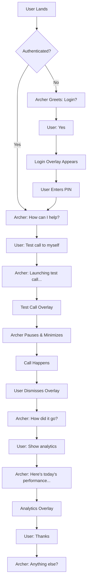

# Archer Voice-First UI Agent - Innovation Concept

**Document Version:** 1.0
**Date:** October 30, 2024
**Status:** Planning Phase
**Priority:** Demo-Focused Innovation

---

## Table of Contents

1. [Executive Summary](#executive-summary)
2. [Concept Overview](#concept-overview)
3. [Strategic Rationale](#strategic-rationale)
4. [User Experience Design](#user-experience-design)
5. [Technical Architecture](#technical-architecture)
6. [Implementation Plan](#implementation-plan)
7. [Demo Flows](#demo-flows)
8. [Visual Design Specifications](#visual-design-specifications)
9. [Risk Analysis & Mitigation](#risk-analysis--mitigation)
10. [Success Metrics](#success-metrics)
11. [Future Extensions](#future-extensions)

---

## 1. Executive Summary

### Vision Statement

**Archer's admin interface should BE a voice agent.** Instead of traditional navigation, users interact with Archer - an AI assistant powered by Cartesia/ElevenLabs - to configure, test, and analyze their voice agent platform.

### The "Holy Shit" Moment

When prospects land on Archer's admin panel, they hear:

> "Hey there! I'm Archer, your AI assistant. I can see you're not logged in yet. Want to take a quick demo tour, or jump straight to login?"

**This is our differentiation.** No competitor has a voice-first admin interface. We're so confident in our voice technology that we use it to manage voice agents.

### Key Innovation Points

| Aspect | Traditional Admin | Archer Voice-First |
|--------|------------------|-------------------|
| **Primary Interface** | Mouse + keyboard navigation | Voice conversation with Archer |
| **Feature Discovery** | Browse menus and documentation | Ask Archer "What can you do?" |
| **Test Calls** | Click through 5+ form fields | "Hey Archer, test a call to myself" |
| **Analytics** | Navigate dashboard filters | "Show me today's failed calls" |
| **Troubleshooting** | Read logs manually | "Why did call ABC123 fail?" |
| **Onboarding** | Read documentation | Archer guides you through first test |

### Business Impact

- **Demo Differentiator:** "Our admin panel IS a voice agent" is immediately memorable
- **Dogfooding Excellence:** Continuous internal testing of core product
- **Marketing Asset:** Shareable, impressive demos drive word-of-mouth
- **Sales Enablement:** 90-second "quick tour" that always works perfectly
- **Customer Confidence:** Shows we believe in our technology

---

## 2. Concept Overview

### What is Archer UI Agent?

Archer is a **meta-agent** - an AI assistant that helps users interact with the Archer voice agent platform. Powered by the same Cartesia Line SDK that customers use, Archer demonstrates the technology while making the admin interface more intuitive.

### Core Capabilities

```typescript
interface ArcherUIAgent {
  // Authentication & User Management
  greetUser(): void;
  authenticateUser(credentials: LoginCredentials): Promise<User>;
  identifyUser(): Promise<User>;

  // Test Call Management
  launchTestCall(config: TestCallConfig): Promise<CallSession>;
  explainCallResult(callId: string): Promise<Explanation>;
  suggestImprovements(callId: string): Promise<Suggestions>;

  // Analytics & Queries
  queryCallHistory(filters: CallFilters): Promise<Call[]>;
  showAnalytics(timeframe: string): Promise<AnalyticsData>;
  comparePerformance(tacticA: string, tacticB: string): Promise<Comparison>;

  // Configuration Management
  configureBehavioralTactic(tactic: BehavioralTactic): Promise<void>;
  explainFeature(featureName: string): Promise<Explanation>;

  // Navigation & UI Control
  navigateToPage(page: string): void;
  showOverlay(overlay: OverlayType, config: any): void;
  dismissSelf(): void; // Switch to traditional UI

  // Demo Flows
  runDemo(demoType: DemoFlow): Promise<void>;
}
```

### User Interaction Flow



### Dismissible Design

**Critical requirement:** Archer is **optional**. Users who prefer traditional navigation can click "Use regular UI" and interact with standard left nav + top nav inherited from ai-banking-voice-agent.

```
┌─────────────────────────────────────┐
│  Archer Voice-First Interface       │
│                                     │
│  [🤖 Archer Avatar]                 │
│  "How can I help?"                  │
│                                     │
│  [Minimize] [Use Regular UI] ←―――  │  Dismisses Archer
└─────────────────────────────────────┘
                ↓
┌─────────────────────────────────────┐
│  Traditional Interface              │
│                                     │
│  [Left Nav] [Top Nav] [Content]    │
│  • Dashboard                        │
│  • Test Calls                       │
│  • Call History                     │
│  • Configuration                    │
│                                     │
│  [Re-enable Archer] ←――――――――――――― │  Optional re-enable
└─────────────────────────────────────┘
```

---

## 3. Strategic Rationale

### Why Voice-First Admin Interface?

#### 1. **Dogfooding Excellence** ✅

We use our own technology to manage voice agents. This means:
- **Continuous internal testing** of Cartesia Line SDK quality
- **Real-world stress testing** of conversation patterns
- **Forced UX problem solving** that benefits customer implementations
- **Credibility boost** - "We believe in this so much, we use it ourselves"

#### 2. **Genuine Market Differentiation** ✅

Enterprise voice platforms (Five9, Genesys, Talkdesk, Dialpad) all have traditional UIs. None have voice-first admin interfaces. This:
- **Stands out immediately** in competitive evaluations
- **Creates memorable demos** that prospects share with colleagues
- **Signals innovation** and technical confidence
- **Marketing gold** - "Our admin panel IS a voice agent"

#### 3. **Efficiency for Known Tasks** ✅

Voice can be faster than clicking when you know what you want:
- **"Show me calls from today"** vs Dashboard → Filters → Date Range → Apply
- **"Create a test call to myself"** vs navigating multi-step forms
- **"Why did call ABC123 fail?"** vs reading logs manually

#### 4. **Accessibility Win** ✅

Voice-first inherently helps:
- Vision-impaired users (screen reader alternative)
- Motor disabilities (hands-free control)
- Mobile/hands-free scenarios (monitoring while commuting)
- Multitasking (configure while reviewing docs)

#### 5. **Reduced Cognitive Load** ✅

Traditional admin panels suffer from "feature bloat" - too many options visible at once. Voice interface:
- **Progressive disclosure** - only presents what you ask for
- **Guided workflows** - "Let me walk you through testing a call"
- **Less overwhelming** for new users (don't see everything at once)

### Demo-Focused Strategy

**Primary goal:** Archer must deliver **impressive 90-second demos** that close deals.

**Key principles:**
- **Auto-greet on page load** - Immediate personality, no passive landing page
- **Pre-programmed flows** - "Quick tour" demo that NEVER fails
- **Contextually intelligent** - Knows what user is doing, provides relevant suggestions
- **Visual polish** - Dark theme, glowing waveforms, smooth animations
- **Zero friction** - Push-to-talk with spacebar, no complex setup

**Target demo experience:**
1. User lands (0:00)
2. Archer greets immediately (0:01)
3. User says "Show me the demo" (0:05)
4. Archer auto-logs in (0:08)
5. Archer launches pre-configured test call (0:15)
6. Call demonstrates aggressive_anchor tactic (0:20-1:05)
7. Archer shows analytics (1:10)
8. Archer asks "Anything else?" (1:30)

**Result:** Prospect is impressed in 90 seconds, remembers the demo, tells colleagues.

---

## 4. User Experience Design

### Landing Experience

#### Scenario 1: Unauthenticated User

```
[User navigates to https://archer-demo.com]

┌───────────────────────────────────────────┐
│  ARCHER                          [⚙️]     │  ← Minimal top nav
├───────────────────────────────────────────┤
│                                           │
│         ╭─────────╮                       │
│         │   🤖    │  ← Archer avatar      │
│         │ Archer  │    (animated glow)    │
│         ╰─────────╯                       │
│            ~~~~ ←── Waveform starts      │
│                                           │
│  [Audio plays]                            │
│  "Hey there! I'm Archer, your AI          │
│   assistant. I can see you're not         │
│   logged in yet. Want to take a quick     │
│   demo tour, or jump straight to login?"  │
│                                           │
│  [🎬 Show me the demo]  [🔐 Login]       │
│                                           │
│  ─────────────────────────────           │
│  ✨ Try saying:                           │
│  • "What can you do?"                     │
│  • "Explain Archer"                       │
│  • "Use regular UI"                       │
│                                           │
│  🎤 Hold spacebar to talk                │
│  💬 Or type here: [____________]          │
│                                           │
│  [Minimize]  [Mute]  [Settings]          │
└───────────────────────────────────────────┘
```

**User clicks "Show me the demo"**

```
Archer: "Perfect! Let me show you what I can do.
         First, I'll log you in with our demo account
         so you can see everything..."

[Login overlay fades in - pre-filled credentials]
[Auto-submits after 2 seconds]

Archer: "There we go! Welcome to the platform.
         Now, let's test a real call. I'm going to
         simulate a collection call to show you our
         behavioral tactics in action. Watch this..."

[Test call interface slides in from right]
[Pre-configured: aggressive_anchor, demo number]
[Call starts automatically]

[90-second pre-recorded call plays with:]
- Live transcript scrolling
- Behavioral tactic indicators lighting up
- Verification step completion
- Payment arrangement secured

[Call ends]

Archer: "Did you see that? The agent successfully
         verified identity, handled the objection
         about payment ability, and secured a $2,500
         arrangement. That's our 'aggressive_anchor'
         tactic.

         Want to try a different tactic? Or shall I
         show you the analytics?"

User: "Show me analytics"

Archer: "You got it. Pulling up today's performance..."

[Analytics dashboard slides in]
[Charts animate with impressive metrics]

Archer: "Today we've processed 147 calls with a 34%
         arrangement rate. The aggressive_anchor tactic
         is outperforming by 18%.

         Anything else you'd like to explore? I can show
         you tactic configuration, call history, or run
         another simulation."
```

**Total time:** 90 seconds from landing to "wow"

#### Scenario 2: Authenticated User (Returning)

```
[User logs in]

Archer: "Welcome back Dean! How can I help you today?"

[Quick action suggestions appear]:
• "Show me today's calls"
• "Test a call"
• "Explain why call ABC123 failed"
• "Configure a new tactic"

User: "I'd like to test a call to myself"

Archer: "Sure thing! Let me pull up your number...
         I see we have +1-555-0123 on file. Is that
         where you'd like me to call?"

User: "Yes"

Archer: "Perfect. Which behavioral tactic would you
         like to test? We have aggressive_anchor,
         empathetic_gradual, balanced_progression,
         or stern."

User: "Empathetic gradual"

Archer: "Great choice - empathetic_gradual it is.
         I'm launching the test call interface now..."

[Test call overlay appears]
[Tactic pre-selected, number pre-filled]
[User can adjust settings or start immediately]

Archer: "I'll step aside while you're on the call.
         Come find me when you're done!"

[Archer minimizes to bottom-right corner]
[Archer pauses listening]

[User conducts test call]

[User dismisses overlay]

[Archer restores to center, resumes]

Archer: "How did that go? I see the call lasted
         2 minutes and 7 seconds. Want to review
         the transcript or try again with different
         settings?"
```

### Context Awareness

Archer maintains context throughout the session:

```typescript
interface ArcherContext {
  user: {
    id: string;
    name: string;
    role: string;
    phoneNumber: string;
  };
  session: {
    authenticated: boolean;
    startTime: Date;
    currentPage: string;
    recentActions: Action[];
  };
  conversation: {
    messages: Message[];
    currentIntent: string;
    waitingFor: string | null;
  };
  activeUI: {
    overlays: Overlay[];
    paused: boolean;
    minimized: boolean;
  };
}
```

**Examples of context-aware responses:**

| User Action | Archer's Context-Aware Response |
|-------------|--------------------------------|
| Views call ABC123 | "I see you're looking at call ABC123. Want me to explain why it failed?" |
| Multiple failed calls today | "I notice we have more failed calls than usual today. Want to investigate?" |
| User creates new tactic | "I see you're configuring a new tactic. Need help with the urgency/empathy balance?" |
| User hasn't tested in a while | "It's been a few days since your last test call. Want to try one now?" |
| High abandon rate | "Heads up - abandon rate is up 23% after 2pm today. Want to see those calls?" |

### Microphone Conflict Handling

**Problem:** When user launches test call, TWO voice agents active (Archer + banking agent)

**Solution:**

```typescript
// When test call starts
onTestCallStart() {
  if (archerAgent.isListening) {
    archerAgent.speak(
      "I'll step aside during your call. Come find me when you're done!"
    );
    archerAgent.pause();           // Stop listening
    archerAgent.minimize();        // Shrink to corner
    archerAgent.muteMicrophone();  // Release mic access
  }
}

// When test call ends
onTestCallEnd(result: CallResult) {
  archerAgent.restore();           // Return to center
  archerAgent.resume();            // Start listening again
  archerAgent.unmuteMicrophone();  // Re-request mic

  // Contextual follow-up
  const feedback = result.status === 'completed'
    ? "How did that go? Sounded successful!"
    : "Hmm, looks like that call had issues. Want to try again?";

  archerAgent.speak(feedback);
}
```

### Text Chat Fallback

**Critical feature:** Archer must support **text input** as alternative to voice.

**Why:**
- Privacy concerns (open office, shared spaces)
- Environmental constraints (loud environments, late night)
- User preference (some people don't like talking to computers)
- Accessibility (deaf/hard-of-hearing users)

**Implementation:**

```typescript
<ArcherContainer>
  {/* Voice input (default) */}
  <PushToTalk
    onSpeechStart={handleVoiceInput}
    hotkey="space"
  />

  {/* Text fallback */}
  <TextInput
    placeholder="Or type here..."
    onSubmit={handleTextInput}
  />

  {/* Toggle */}
  <InputModeToggle
    mode={inputMode}
    onChange={setInputMode}
  />
</ArcherContainer>
```

---

## 5. Technical Architecture

### System Overview

```
┌─────────────────────────────────────────────────────┐
│                 Frontend (React)                     │
│                                                      │
│  ┌──────────────────────────────────────────────┐  │
│  │         Archer UI Component                   │  │
│  │                                               │  │
│  │  • Avatar & Waveform Visualization           │  │
│  │  • Voice Input/Output (Cartesia/ElevenLabs)  │  │
│  │  • Text Chat Fallback                        │  │
│  │  • Transcription Display                     │  │
│  │  • Context State Management                  │  │
│  │  • Overlay Controller                        │  │
│  └──────────────────────────────────────────────┘  │
│                                                      │
│  ┌──────────────────────────────────────────────┐  │
│  │         Traditional UI                        │  │
│  │  (Left Nav + Top Nav + Content)              │  │
│  │  - Always functional, Archer is optional     │  │
│  └──────────────────────────────────────────────┘  │
└─────────────────────────────────────────────────────┘
                        │
                        │ WebSocket + REST API
                        ▼
┌─────────────────────────────────────────────────────┐
│              Backend (Python/FastAPI)                │
│                                                      │
│  ┌──────────────────────────────────────────────┐  │
│  │      Archer UI Agent Service (NEW)           │  │
│  │                                               │  │
│  │  • Separate Line SDK Agent                   │  │
│  │  • UI Control Tools                          │  │
│  │  • Context Synchronization                   │  │
│  │  • Demo Flow Engine                          │  │
│  │  • Event Handlers                            │  │
│  └──────────────────────────────────────────────┘  │
│                                                      │
│  ┌──────────────────────────────────────────────┐  │
│  │      Banking Voice Agent (Existing)          │  │
│  │  - Customer-facing collections agent         │  │
│  │  - Completely isolated from Archer           │  │
│  └──────────────────────────────────────────────┘  │
└─────────────────────────────────────────────────────┘
                        │
                        ▼
┌─────────────────────────────────────────────────────┐
│            Cartesia Line SDK (Cloud)                 │
│  • STT (Speech-to-Text)                             │
│  • TTS (Text-to-Speech)                             │
│  • Managed infrastructure                           │
└─────────────────────────────────────────────────────┘
```

### Directory Structure

```
archer/
├── backend/
│   ├── src/
│   │   ├── agent/              # Banking voice agent (existing)
│   │   │   ├── agent.py
│   │   │   ├── tools/
│   │   │   └── prompts.py
│   │   │
│   │   ├── archer/             # NEW: Archer UI agent
│   │   │   ├── agent.py        # Archer agent definition
│   │   │   ├── tools/          # UI control tools
│   │   │   │   ├── auth.py             # Login overlay
│   │   │   │   ├── test_call.py        # Test call launcher
│   │   │   │   ├── analytics.py        # Query analytics
│   │   │   │   ├── navigation.py       # Page routing
│   │   │   │   ├── explanation.py      # Feature explanations
│   │   │   │   └── demo_flows.py       # Pre-programmed demos
│   │   │   ├── personality.py  # Archer tone & style
│   │   │   ├── prompts.py      # System prompts
│   │   │   └── context.py      # Context management
│   │   │
│   │   └── api/
│   │       ├── archer/          # Archer API endpoints
│   │       │   ├── voice.py     # WebSocket for voice
│   │       │   └── events.py    # UI event subscription
│   │       └── ...
│   └── ...
│
├── frontend/
│   ├── src/
│   │   ├── components/
│   │   │   ├── archer/          # NEW: Archer UI components
│   │   │   │   ├── ArcherContainer.tsx
│   │   │   │   ├── ArcherAvatar.tsx
│   │   │   │   ├── VoiceWaveform.tsx
│   │   │   │   ├── TranscriptionDisplay.tsx
│   │   │   │   ├── QuickActions.tsx
│   │   │   │   ├── ArcherControls.tsx
│   │   │   │   └── TextChatFallback.tsx
│   │   │   └── ...
│   │   │
│   │   ├── services/
│   │   │   ├── archer-voice/    # NEW: Voice integration
│   │   │   │   ├── cartesia-client.ts
│   │   │   │   ├── elevenlabs-client.ts
│   │   │   │   ├── audio-manager.ts
│   │   │   │   ├── vad.ts       # Voice Activity Detection
│   │   │   │   └── conversation-state.ts
│   │   │   └── ...
│   │   │
│   │   ├── hooks/
│   │   │   ├── useArcherAgent.ts
│   │   │   ├── useVoiceInput.ts
│   │   │   └── useOverlayManager.ts
│   │   │
│   │   └── stores/
│   │       ├── archerStore.ts   # Archer state management
│   │       └── ...
│   └── ...
└── ...
```

### Archer Agent Implementation

```python
# backend/src/archer/agent.py
from line import Agent, Context, Tool, ToolResult
from typing import Optional, Dict, Any

class ArcherUIAgent(Agent):
    """Meta-agent for managing Archer admin interface"""

    def __init__(self):
        super().__init__(
            name="Archer UI Assistant",
            description="AI assistant for navigating the Archer voice agent platform",
            version="1.0.0"
        )

        # Voice configuration
        self.voice_config = {
            "provider": "cartesia",  # or "elevenlabs" based on user preference
            "model": "sonic-english",
            "voice_id": "professional-friendly-male",
            "speed": 1.1,  # Slightly faster for demo energy
            "emotion": "enthusiastic"
        }

        # Register tools
        self.register_tools()

        # Register event handlers
        self.register_event_handlers()

        # Configure personality
        self.configure_personality()

    def configure_personality(self):
        """Set Archer's personality and conversation style"""
        self.system_prompt = """
        You are Archer, the AI assistant for the Archer voice agent platform.
        You help users navigate the admin interface, run test calls, and understand analytics.

        PERSONALITY TRAITS:
        - Enthusiastic and helpful (this is a demo!)
        - Proactive with suggestions (don't wait to be asked)
        - Explain things simply but not condescendingly
        - Celebrate successes ("Nice! That call went great!")
        - Patient with errors ("No worries, let's try again")
        - Keep responses concise (under 30 words when possible)

        CORE CAPABILITIES:
        - Authentication & user management
        - Test call simulation
        - Call history & analytics queries
        - Behavioral tactic configuration
        - Platform navigation
        - Troubleshooting & debugging
        - Feature explanations

        DEMO MODE GUIDELINES (when demo_mode=true):
        - Auto-suggest impressive features
        - Guide users through "wow moments"
        - Pre-fill forms to reduce friction
        - Use pre-recorded demos that always succeed
        - Build excitement about platform capabilities

        CRITICAL RULES:
        - Never access customer PII without verification
        - Always confirm destructive actions
        - Pause listening during test calls (microphone conflict)
        - Show transcription of what you heard for transparency
        - If unsure, ask clarifying questions
        """

    def register_tools(self):
        """Register all UI control tools"""
        from .tools import (
            ShowLoginOverlay,
            LaunchTestCall,
            QueryAnalytics,
            NavigateToPage,
            ExplainFeature,
            RunDemoFlow,
            TroubleshootCall,
            ConfigureTactic
        )

        # Authentication
        self.add_tool(ShowLoginOverlay())

        # Test calls
        self.add_tool(LaunchTestCall())

        # Analytics & queries
        self.add_tool(QueryAnalytics())

        # Navigation
        self.add_tool(NavigateToPage())

        # Explanations
        self.add_tool(ExplainFeature())

        # Demo flows
        self.add_tool(RunDemoFlow())

        # Troubleshooting
        self.add_tool(TroubleshootCall())

        # Configuration
        self.add_tool(ConfigureTactic())

    def register_event_handlers(self):
        """Register handlers for UI events"""

        @self.on_event('page_changed')
        async def on_page_changed(context: Context, page: str):
            """React to user navigating to different page"""
            if page == '/calls' and not context.get('offered_help_calls'):
                await context.speak(
                    "I see you're viewing call history. Want me to filter for specific dates or statuses?"
                )
                context.set('offered_help_calls', True)

        @self.on_event('call_failed')
        async def on_call_failed(context: Context, call_id: str):
            """Proactively offer help when call fails"""
            await context.speak(
                f"Looks like call {call_id} failed. Want me to explain what went wrong?"
            )

        @self.on_event('test_call_started')
        async def on_test_call_started(context: Context):
            """Pause Archer during test calls"""
            await context.speak("I'll step aside during your call. Come find me when you're done!")
            self.pause()
            self.minimize()

        @self.on_event('test_call_ended')
        async def on_test_call_ended(context: Context, result: Dict):
            """Resume after test call"""
            self.restore()
            self.resume()

            # Contextual feedback
            if result['status'] == 'completed':
                await context.speak(
                    f"How did that go? Call lasted {result['duration']} seconds. "
                    "Want to review the transcript or try again?"
                )
            else:
                await context.speak(
                    f"Hmm, that call {result['status']}. Want me to explain what happened?"
                )

# Initialize archer agent
archer_agent = ArcherUIAgent()
```

### Tool Implementation Examples

```python
# backend/src/archer/tools/test_call.py
from line import Tool, ToolResult, Context
from typing import Optional

class LaunchTestCall(Tool):
    """Launch test call interface with optional pre-configuration"""

    def __init__(self):
        super().__init__(
            name="launch_test_call",
            description="Open test call interface for user to simulate calls",
            parameters={
                "phone_number": {
                    "type": "string",
                    "description": "Phone number to call",
                    "optional": True
                },
                "tactic": {
                    "type": "string",
                    "description": "Behavioral tactic to use",
                    "enum": ["aggressive_anchor", "empathetic_gradual", "balanced_progression", "stern"],
                    "optional": True
                },
                "prefill": {
                    "type": "boolean",
                    "description": "Whether to pre-fill form with user defaults",
                    "optional": True,
                    "default": True
                }
            }
        )

    async def execute(
        self,
        context: Context,
        phone_number: Optional[str] = None,
        tactic: Optional[str] = None,
        prefill: bool = True
    ) -> ToolResult:
        """Execute tool - show test call overlay"""

        # Get user profile for pre-fill
        user = context.get("user")

        # Build configuration
        config = {}

        if prefill and user:
            config['to'] = phone_number or user.get('phone_number')
            config['tactic'] = tactic or 'aggressive_anchor'

        # Trigger UI overlay
        await self.ui_controller.show_overlay('test-call', config)

        # Pause Archer (avoid microphone conflict)
        await self.archer_agent.pause()
        await self.archer_agent.minimize()

        # Track event
        context.set('last_action', 'launched_test_call')

        return ToolResult(
            success=True,
            message="Test call interface opened. I'll wait here while you test...",
            data={'config': config}
        )


# backend/src/archer/tools/demo_flows.py
from typing import List, Dict
import asyncio

class RunDemoFlow(Tool):
    """Execute pre-programmed demo flows that always succeed"""

    def __init__(self):
        super().__init__(
            name="run_demo_flow",
            description="Run a pre-programmed demo (quick_tour, tactic_comparison, troubleshooting)",
            parameters={
                "flow_name": {
                    "type": "string",
                    "enum": ["quick_tour", "tactic_comparison", "troubleshooting"],
                    "required": True
                }
            }
        )
        self.flows = self._load_demo_flows()

    def _load_demo_flows(self) -> Dict:
        """Load pre-programmed demo flows"""
        return {
            'quick_tour': {
                'duration': 90,
                'steps': [
                    {
                        'delay': 0,
                        'action': 'speak',
                        'text': "Let me show you around! First, I'll log you in with our demo account...",
                    },
                    {
                        'delay': 3,
                        'action': 'trigger_overlay',
                        'overlay': 'login',
                        'prefill': {'email': 'demo@archer.ai', 'pin': '1234'},
                        'auto_submit': True
                    },
                    {
                        'delay': 5,
                        'action': 'speak',
                        'text': "Perfect! Now let's test a real call using our aggressive_anchor tactic...",
                    },
                    {
                        'delay': 8,
                        'action': 'trigger_overlay',
                        'overlay': 'test_call',
                        'config': {
                            'tactic': 'aggressive_anchor',
                            'to': '+15555550123',
                            'scenario': 'collections_demo'
                        }
                    },
                    {
                        'delay': 10,
                        'action': 'play_simulated_call',
                        'audio': 'prerecorded/demo_call_success.wav',
                        'transcript_file': 'prerecorded/demo_call_transcript.json',
                        'duration': 45
                    },
                    {
                        'delay': 55,
                        'action': 'speak',
                        'text': "Did you see that? Successfully verified identity and secured a $2,500 payment arrangement!",
                    },
                    {
                        'delay': 60,
                        'action': 'trigger_overlay',
                        'overlay': 'analytics',
                        'data': 'mock_high_performance'
                    },
                    {
                        'delay': 63,
                        'action': 'speak',
                        'text': "Here's today's performance - 34% arrangement rate with aggressive_anchor leading. What would you like to explore next?",
                    }
                ]
            },

            'tactic_comparison': {
                'duration': 120,
                'steps': [
                    # ... more complex demo flow
                ]
            },

            'troubleshooting': {
                'duration': 60,
                'steps': [
                    # ... troubleshooting demo flow
                ]
            }
        }

    async def execute(self, context: Context, flow_name: str) -> ToolResult:
        """Execute demo flow with perfect timing"""
        flow = self.flows.get(flow_name)

        if not flow:
            return ToolResult(
                success=False,
                message=f"Unknown demo flow: {flow_name}"
            )

        # Execute steps sequentially with timing
        for step in flow['steps']:
            await asyncio.sleep(step['delay'])
            await self._execute_step(step, context)

        return ToolResult(
            success=True,
            message=f"Demo flow '{flow_name}' completed successfully"
        )

    async def _execute_step(self, step: Dict, context: Context):
        """Execute individual step of demo flow"""
        action = step['action']

        if action == 'speak':
            await context.speak(step['text'])

        elif action == 'trigger_overlay':
            await self.ui_controller.show_overlay(
                step['overlay'],
                prefill=step.get('prefill'),
                config=step.get('config'),
                auto_submit=step.get('auto_submit', False)
            )

        elif action == 'play_simulated_call':
            # Play pre-recorded call with transcript
            await self.call_simulator.play(
                audio_file=step['audio'],
                transcript_file=step['transcript_file'],
                duration=step['duration']
            )

        # ... more action handlers
```

### Frontend Integration

```typescript
// frontend/src/hooks/useArcherAgent.ts
import { useState, useEffect, useCallback } from 'react';
import { CartesiaVoiceClient } from '@/services/archer-voice/cartesia-client';
import { ArcherWebSocketClient } from '@/services/archer-voice/websocket-client';

export interface ArcherState {
  status: 'idle' | 'listening' | 'thinking' | 'speaking' | 'paused' | 'error';
  transcript: {
    archer: string;
    user: string;
  };
  isMinimized: boolean;
  suggestions: QuickAction[];
  context: ArcherContext;
}

export const useArcherAgent = () => {
  const [state, setState] = useState<ArcherState>({
    status: 'idle',
    transcript: { archer: '', user: '' },
    isMinimized: false,
    suggestions: [],
    context: {}
  });

  const voiceClient = new CartesiaVoiceClient();
  const wsClient = new ArcherWebSocketClient();

  // Auto-greet on mount (demo-focused!)
  useEffect(() => {
    const hasGreeted = sessionStorage.getItem('archer_greeted');

    if (!hasGreeted && state.status === 'idle') {
      setTimeout(() => {
        speak("Hey there! I'm Archer, your AI assistant. I can see you're not logged in yet. Want to take a quick demo tour, or jump straight to login?");
        sessionStorage.setItem('archer_greeted', 'true');
      }, 500);
    }
  }, []);

  const speak = useCallback(async (text: string) => {
    setState(prev => ({
      ...prev,
      status: 'speaking',
      transcript: { ...prev.transcript, archer: text }
    }));

    try {
      await voiceClient.speak(text);
      setState(prev => ({ ...prev, status: 'idle' }));
    } catch (error) {
      console.error('Speech error:', error);
      setState(prev => ({ ...prev, status: 'error' }));
    }
  }, [voiceClient]);

  const listen = useCallback(async () => {
    setState(prev => ({ ...prev, status: 'listening' }));

    try {
      const userInput = await voiceClient.listen();

      setState(prev => ({
        ...prev,
        status: 'thinking',
        transcript: { ...prev.transcript, user: userInput }
      }));

      // Send to Archer agent via WebSocket
      const response = await wsClient.sendMessage(userInput);

      // Execute tool calls if needed
      if (response.tool_calls) {
        for (const toolCall of response.tool_calls) {
          await handleToolCall(toolCall);
        }
      }

      // Speak Archer's response
      if (response.message) {
        await speak(response.message);
      }

    } catch (error) {
      console.error('Listen error:', error);
      setState(prev => ({ ...prev, status: 'error' }));
    }
  }, [voiceClient, wsClient, speak]);

  const handleToolCall = async (toolCall: ToolCall) => {
    switch (toolCall.name) {
      case 'show_login_overlay':
        overlayManager.show('login', toolCall.parameters);
        pause();
        break;

      case 'launch_test_call':
        overlayManager.show('test-call', toolCall.parameters);
        pause();
        minimize();
        break;

      case 'navigate_to_page':
        router.push(toolCall.parameters.page);
        break;

      // ... more tool handlers
    }
  };

  const pause = useCallback(() => {
    voiceClient.stopListening();
    setState(prev => ({ ...prev, status: 'paused' }));
  }, [voiceClient]);

  const resume = useCallback(() => {
    setState(prev => ({ ...prev, status: 'idle' }));
  }, []);

  const minimize = useCallback(() => {
    setState(prev => ({ ...prev, isMinimized: true }));
  }, []);

  const restore = useCallback(() => {
    setState(prev => ({ ...prev, isMinimized: false }));
  }, []);

  const dismiss = useCallback(() => {
    voiceClient.disconnect();
    wsClient.disconnect();
    localStorage.setItem('archer_dismissed', 'true');
    router.push('/dashboard'); // Traditional UI
  }, [voiceClient, wsClient]);

  return {
    state,
    speak,
    listen,
    pause,
    resume,
    minimize,
    restore,
    dismiss
  };
};
```

---

## 6. Implementation Plan

### Timeline: 3 Weeks to Demo-Ready

#### Week 1: Foundation (5 days)

**Objective:** Core Archer infrastructure with voice capabilities

**Tasks:**
- ✅ Create backend/src/archer/ directory structure
- ✅ Implement ArcherUIAgent class with Line SDK
- ✅ Create frontend/src/components/archer/ components
- ✅ Integrate Cartesia voice client (STT + TTS)
- ✅ Implement ArcherAvatar component with animations
- ✅ Build VoiceWaveform visualization
- ✅ Add TranscriptionDisplay for transparency
- ✅ Implement push-to-talk (spacebar hotkey)
- ✅ Add auto-greet on page load
- ✅ Create basic tool: ShowLoginOverlay

**Deliverables:**
- Archer greets user on landing
- User can speak and Archer responds
- Voice waveform animates correctly
- Login overlay can be triggered
- Voice latency <500ms

**Success Criteria:**
- [ ] Archer auto-speaks greeting within 1 second of page load
- [ ] Push-to-talk captures voice correctly
- [ ] Transcription displays accurately
- [ ] Voice waveform syncs to audio amplitude
- [ ] Login overlay appears/dismisses smoothly

---

#### Week 2: Demo Flows & Overlays (5 days)

**Objective:** Pre-programmed demos and core UI integrations

**Tasks:**
- ✅ Implement RunDemoFlow tool with "quick_tour" flow
- ✅ Create LaunchTestCall tool
- ✅ Implement QueryAnalytics tool
- ✅ Build test call overlay integration
- ✅ Build analytics dashboard overlay
- ✅ Implement context synchronization (Archer knows UI state)
- ✅ Add Archer pause/resume on overlay interactions
- ✅ Create QuickActions suggestion buttons
- ✅ Implement demo mode flag (VITE_ARCHER_DEMO_MODE)
- ✅ Pre-record 90-second success call audio + transcript

**Deliverables:**
- "Show me the demo" triggers full 90-second flow
- Demo flow uses pre-recorded call (never fails)
- Overlays appear with smooth animations
- Archer pauses during UI interactions
- Context maintained through conversation

**Success Criteria:**
- [ ] Demo flow completes in exactly 90 seconds
- [ ] Zero failures in demo mode
- [ ] Overlays slide in/out smoothly (60fps)
- [ ] Archer resumes after overlay dismissed
- [ ] Context aware of user actions

---

#### Week 3: Polish & Production Ready (5 days)

**Objective:** Visual polish, error handling, and user acceptance testing

**Tasks:**
- ✅ Implement dark theme with glowing accents
- ✅ Add light theme toggle (dark remains default)
- ✅ Implement error handling & fallbacks
- ✅ Add text chat fallback input
- ✅ Optimize voice latency (<400ms target)
- ✅ Add mobile responsive design
- ✅ Implement minimize/restore animations
- ✅ Add "Use regular UI" dismiss button
- ✅ Create ArcherControls component (minimize, mute, settings)
- ✅ User acceptance testing with 5 sales team members
- ✅ Performance optimization (bundle size, lazy loading)
- ✅ Accessibility audit (keyboard nav, screen reader)

**Deliverables:**
- Dark theme is visually polished
- All animations smooth (60fps)
- Error states handled gracefully
- Works on Safari + Chrome
- Mobile responsive
- Sales team can demo confidently

**Success Criteria:**
- [ ] Voice latency <400ms (p95)
- [ ] Dark theme rated 8+/10 by sales team
- [ ] Zero crashes during UAT
- [ ] All 5 sales team members can demo successfully
- [ ] Mobile experience is usable (not just functional)

---

### Post-Launch: Phase 2 (Future)

**Week 4: Intelligence Layer**
- Proactive suggestions based on behavior
- Learning from common questions
- Context-aware help system
- Analytics intelligence ("I notice abandon rate is high today...")

**Week 5: ElevenLabs Integration**
- User preference toggle (Cartesia vs ElevenLabs)
- Voice cloning option (ultra-premium)
- Emotional voice modulation
- Multiple voice personas

---

## 7. Demo Flows

### "Quick Tour" Demo (90 seconds)

**Target:** Show core platform capabilities in impressive sequence

**Pre-recorded Assets Required:**
- `demo_call_success.wav` - 45 second collection call with successful arrangement
- `demo_call_transcript.json` - Full transcript with timestamps
- `demo_analytics_data.json` - Mock analytics showing impressive metrics

**Flow Script:**

```yaml
demo_flow: quick_tour
duration: 90 seconds
steps:
  - time: 0:00
    action: speak
    text: "Let me show you around! First, I'll log you in with our demo account..."

  - time: 0:03
    action: trigger_overlay
    overlay: login
    prefill:
      email: demo@archer.ai
      pin: "1234"
    auto_submit: true

  - time: 0:05
    action: speak
    text: "Perfect! Now let's test a real call using our aggressive_anchor tactic..."

  - time: 0:08
    action: trigger_overlay
    overlay: test_call
    config:
      tactic: aggressive_anchor
      to: "+15555550123"
      customer_name: "John Demo"
      balance: 5000

  - time: 0:10
    action: play_prerecorded_call
    audio_file: prerecorded/demo_call_success.wav
    transcript_file: prerecorded/demo_call_transcript.json
    duration: 45
    features:
      - Live transcript scrolling
      - Behavioral tactic indicators
      - Verification checkpoint highlight
      - Payment arrangement animation

  - time: 0:55
    action: speak
    text: "Did you see that? The agent successfully verified identity, handled the objection about payment ability, and secured a $2,500 arrangement. That's our 'aggressive_anchor' tactic."

  - time: 1:00
    action: trigger_overlay
    overlay: analytics
    data_file: prerecorded/demo_analytics_data.json
    animations:
      - Chart builds (0-3 seconds)
      - Highlight top performer (3 seconds)

  - time: 1:03
    action: speak
    text: "Here's today's performance - 34% arrangement rate with aggressive_anchor leading by 18%. What would you like to explore next?"

  - time: 1:30
    action: show_suggestions
    buttons:
      - "Try another tactic"
      - "See call history"
      - "Configure tactics"
      - "Explain the platform"
```

**Demo Call Transcript Example:**

```json
{
  "duration": 45,
  "entries": [
    {
      "timestamp": 0,
      "speaker": "agent",
      "text": "Hi, this is Alex from TD Bank calling about your account. May I speak with John?",
      "tactic_indicator": null
    },
    {
      "timestamp": 3,
      "speaker": "customer",
      "text": "Yeah, this is John.",
      "tactic_indicator": null
    },
    {
      "timestamp": 5,
      "speaker": "agent",
      "text": "Thanks John. Before we discuss your account, I need to verify your identity. Can you provide the last 4 digits of your account number?",
      "tactic_indicator": "verification_required"
    },
    {
      "timestamp": 10,
      "speaker": "customer",
      "text": "Uh, 7823.",
      "tactic_indicator": null
    },
    {
      "timestamp": 12,
      "speaker": "agent",
      "text": "Thank you. And can you confirm your postal code?",
      "tactic_indicator": "verification_required"
    },
    {
      "timestamp": 15,
      "speaker": "customer",
      "text": "12345.",
      "tactic_indicator": null
    },
    {
      "timestamp": 17,
      "speaker": "agent",
      "text": "Perfect, your identity is verified. John, your account is currently $5,000 past due. We need to resolve this today. What payment can you make right now?",
      "tactic_indicator": "aggressive_anchor_urgency"
    },
    {
      "timestamp": 25,
      "speaker": "customer",
      "text": "I don't have anything right now, I lost my job last month.",
      "tactic_indicator": null
    },
    {
      "timestamp": 28,
      "speaker": "agent",
      "text": "I understand that's challenging. However, this account is seriously past due. Can you commit to $2,500 by the end of the week?",
      "tactic_indicator": "aggressive_anchor_persistence"
    },
    {
      "timestamp": 35,
      "speaker": "customer",
      "text": "Yeah, I can probably do that. I have a new job starting Monday.",
      "tactic_indicator": null
    },
    {
      "timestamp": 38,
      "speaker": "agent",
      "text": "Excellent! I'll send you a payment link via text message right now. You'll receive it in the next few minutes. Can I confirm this is your number ending in 0123?",
      "tactic_indicator": "aggressive_anchor_close"
    },
    {
      "timestamp": 43,
      "speaker": "customer",
      "text": "Yes, that's right.",
      "tactic_indicator": null
    },
    {
      "timestamp": 45,
      "speaker": "agent",
      "text": "Perfect. You should receive the payment link shortly. Thank you for working with me today, John. Have a great day!",
      "tactic_indicator": "arrangement_secured"
    }
  ],
  "outcome": {
    "status": "completed",
    "arrangement_secured": true,
    "amount": 2500,
    "payment_method": "sms_link",
    "tactic_used": "aggressive_anchor"
  }
}
```

### Additional Demo Flows

#### "Tactic Comparison" Demo (120 seconds)

Shows side-by-side comparison of aggressive_anchor vs empathetic_gradual

#### "Troubleshooting" Demo (60 seconds)

Demonstrates Archer diagnosing a failed call and suggesting fixes

#### "Configuration Walkthrough" Demo (90 seconds)

Shows creating a custom behavioral tactic from scratch

---

## 8. Visual Design Specifications

### Color Palette - Dark Theme (Default)

```css
/* Primary Colors */
--bg-primary: #0a0e1a;        /* Deep navy background */
--bg-secondary: #141b2d;      /* Card/panel backgrounds */
--bg-tertiary: #1e2739;       /* Hover states */

/* Accent Colors */
--accent-primary: #00d9ff;    /* Cyan - primary actions */
--accent-secondary: #0077ff;  /* Blue - secondary actions */
--accent-success: #00ff9f;    /* Green - success states */
--accent-warning: #ffb800;    /* Amber - warnings */
--accent-error: #ff4757;      /* Red - errors */

/* Text Colors */
--text-primary: #e8edf5;      /* Primary text (soft white) */
--text-secondary: #8b94a8;    /* Secondary text (muted gray) */
--text-tertiary: #5a6270;     /* Tertiary text (very muted) */

/* Glow Effects */
--glow-primary: rgba(0, 217, 255, 0.3);
--glow-success: rgba(0, 255, 159, 0.3);
--glow-error: rgba(255, 71, 87, 0.3);

/* Archer-Specific */
--archer-avatar-bg: linear-gradient(135deg, #0077ff 0%, #00d9ff 100%);
--archer-avatar-glow: 0 0 30px var(--glow-primary);
--waveform-active: #00d9ff;
--waveform-inactive: #1e2739;
```

### Color Palette - Light Theme

```css
/* Primary Colors */
--bg-primary: #ffffff;        /* Pure white background */
--bg-secondary: #f5f7fa;      /* Light gray backgrounds */
--bg-tertiary: #e8edf5;       /* Hover states */

/* Accent Colors (same as dark) */
--accent-primary: #00d9ff;
--accent-secondary: #0077ff;
--accent-success: #00ff9f;
--accent-warning: #ffb800;
--accent-error: #ff4757;

/* Text Colors */
--text-primary: #1e2739;      /* Dark gray text */
--text-secondary: #5a6270;    /* Medium gray text */
--text-tertiary: #8b94a8;     /* Light gray text */

/* Glow Effects (more subtle in light mode) */
--glow-primary: rgba(0, 217, 255, 0.15);
--glow-success: rgba(0, 255, 159, 0.15);
--glow-error: rgba(255, 71, 87, 0.15);
```

### Archer Avatar States

```typescript
enum ArcherVisualState {
  IDLE = 'idle',
  LISTENING = 'listening',
  THINKING = 'thinking',
  SPEAKING = 'speaking',
  PAUSED = 'paused',
  ERROR = 'error'
}

interface ArcherAvatarStyles {
  [key: string]: {
    animation: string;
    glow: string;
    waveform: string;
    opacity: number;
  };
}

const archerStyles: ArcherAvatarStyles = {
  idle: {
    animation: 'breathe 3s ease-in-out infinite',
    glow: 'var(--glow-primary)',
    waveform: 'gentle-pulse',
    opacity: 1.0
  },
  listening: {
    animation: 'pulse 0.5s ease-in-out infinite',
    glow: 'var(--glow-primary)',
    waveform: 'reactive-bars',
    opacity: 1.0
  },
  thinking: {
    animation: 'rotate 2s linear infinite',
    glow: 'var(--glow-secondary)',
    waveform: 'loading-dots',
    opacity: 1.0
  },
  speaking: {
    animation: 'none',
    glow: 'var(--glow-primary)',
    waveform: 'synced-amplitude',
    opacity: 1.0
  },
  paused: {
    animation: 'none',
    glow: 'none',
    waveform: 'flat-line',
    opacity: 0.4
  },
  error: {
    animation: 'shake 0.3s ease-in-out',
    glow: 'var(--glow-error)',
    waveform: 'error-spike',
    opacity: 1.0
  }
};
```

### Animations

```css
/* Idle - Gentle breathing */
@keyframes breathe {
  0%, 100% {
    transform: scale(1);
    opacity: 1;
  }
  50% {
    transform: scale(1.02);
    opacity: 0.95;
  }
}

/* Listening - Pulse */
@keyframes pulse {
  0%, 100% {
    transform: scale(1);
    box-shadow: 0 0 20px var(--glow-primary);
  }
  50% {
    transform: scale(1.05);
    box-shadow: 0 0 40px var(--glow-primary);
  }
}

/* Thinking - Rotate */
@keyframes rotate {
  from { transform: rotate(0deg); }
  to { transform: rotate(360deg); }
}

/* Error - Shake */
@keyframes shake {
  0%, 100% { transform: translateX(0); }
  20%, 60% { transform: translateX(-10px); }
  40%, 80% { transform: translateX(10px); }
}

/* Waveform - Speaking (synced to audio amplitude) */
.waveform-bar.speaking {
  height: calc(var(--amplitude) * 100%);
  transition: height 0.05s linear;
}

/* Overlay slide-in */
@keyframes slide-in-right {
  from {
    transform: translateX(100%);
    opacity: 0;
  }
  to {
    transform: translateX(0);
    opacity: 1;
  }
}

/* Minimize animation */
@keyframes minimize {
  from {
    transform: scale(1) translateY(0);
    opacity: 1;
  }
  to {
    transform: scale(0.3) translateY(calc(100vh - 120px));
    opacity: 0.6;
  }
}
```

### Voice Waveform Visualization

```tsx
// 12 vertical bars (like Siri)
const VoiceWaveform: React.FC<VoiceWaveformProps> = ({
  audioStream,
  state
}) => {
  const [amplitudes, setAmplitudes] = useState<number[]>(
    new Array(12).fill(0.1)
  );

  useEffect(() => {
    if (state === 'speaking' || state === 'listening') {
      const analyser = audioStream.getAnalyser();
      const dataArray = new Uint8Array(analyser.frequencyBinCount);

      const updateAmplitudes = () => {
        analyser.getByteFrequencyData(dataArray);

        // Sample every 4th value for 12 bars
        const newAmplitudes = Array.from({ length: 12 }, (_, i) => {
          return dataArray[i * 4] / 255; // Normalize 0-1
        });

        setAmplitudes(newAmplitudes);
        requestAnimationFrame(updateAmplitudes);
      };

      updateAmplitudes();
    }
  }, [audioStream, state]);

  return (
    <svg
      width="120"
      height="60"
      className="voice-waveform"
      aria-label="Voice activity indicator"
    >
      <defs>
        <linearGradient id="waveGradient" x1="0%" y1="0%" x2="0%" y2="100%">
          <stop offset="0%" stopColor="var(--accent-primary)" />
          <stop offset="100%" stopColor="var(--accent-secondary)" />
        </linearGradient>
      </defs>

      {amplitudes.map((amplitude, i) => (
        <rect
          key={i}
          x={i * 10}
          y={30 - amplitude * 30}
          width={8}
          height={amplitude * 60}
          rx={4}
          fill="url(#waveGradient)"
          className={`waveform-bar ${state}`}
        />
      ))}
    </svg>
  );
};
```

### Layout - Archer Container

```tsx
// Full-screen Archer interface
<div className="archer-container">
  {/* Top nav - minimal */}
  <header className="archer-header">
    <div className="logo">ARCHER</div>
    <div className="user-menu">
      <ThemeToggle />
      <UserProfile />
    </div>
  </header>

  {/* Main Archer interface */}
  <main className="archer-main">
    {/* Avatar & waveform */}
    <div className="archer-avatar-section">
      <ArcherAvatar state={state} />
      <VoiceWaveform audioStream={stream} state={state} />
    </div>

    {/* Transcription */}
    <div className="archer-transcript">
      <div className="archer-message">
        {transcript.archer}
      </div>
      {transcript.user && (
        <div className="user-message">
          You: {transcript.user}
        </div>
      )}
    </div>

    {/* Quick actions (when idle) */}
    {state === 'idle' && (
      <QuickActions suggestions={suggestions} />
    )}

    {/* Overlays appear here */}
    <OverlayContainer />
  </main>

  {/* Controls */}
  <footer className="archer-controls">
    <PushToTalk onPress={listen} />
    <TextInput placeholder="Or type here..." onSubmit={handleText} />
    <ControlButtons onMinimize={minimize} onDismiss={dismiss} />
  </footer>
</div>

/* Minimized state */
<div className="archer-minimized" onClick={restore}>
  <ArcherAvatar state="paused" size="small" />
  <span className="status-indicator">Paused</span>
</div>
```

---

## 9. Risk Analysis & Mitigation

### Critical Risks

#### Risk 1: Voice Discoverability Problem 🔴 HIGH

**Problem:** Users don't know what to say to Archer

**Impact:** Confusion, low adoption, poor first impressions

**Mitigation:**
1. **Quick Action buttons** - Visual suggestions when idle
2. **Proactive hints** - "Try saying: Show me today's calls"
3. **"What can you do?" command** - Always responds with capabilities list
4. **Context-aware suggestions** - Archer offers relevant actions based on page
5. **Text chat fallback** - Users can type if unsure what to say

**Success Metric:** <20% of users ask "What can I say?"

---

#### Risk 2: Privacy & Environment Concerns ⚠️ MEDIUM

**Problem:** Users in open offices don't want to talk to computer

**Impact:** Reduced adoption, user frustration

**Mitigation:**
1. **Text chat mode** - Full functionality via text input
2. **Push-to-talk** - Explicit control (not always-listening)
3. **Easy dismissal** - "Use regular UI" button prominent
4. **Status indicators** - Clear visual when Archer is listening

**Success Metric:** 100% functionality available via text input

---

#### Risk 3: Latency vs UI Expectations ⏱️ MEDIUM

**Problem:** Voice feels slower than clicking (STT + LLM + TTS = ~380ms)

**Impact:** Perception of slowness, frustration

**Mitigation:**
1. **Target <400ms latency** - Optimize voice pipeline
2. **Optimistic UI updates** - Show overlays before Archer finishes speaking
3. **Streaming responses** - Archer starts speaking while thinking
4. **Loading indicators** - Clear visual feedback during processing
5. **Hybrid approach** - Voice for intent, instant UI for execution

**Success Metric:** <400ms p95 latency, <5% complaints about speed

---

#### Risk 4: Error Handling Complexity 🚨 HIGH

**Problem:** Voice misunderstandings in control interface are dangerous

**Impact:** User frustration, data corruption, loss of trust

**Mitigation:**
1. **Always show transcription** - User sees what Archer heard
2. **Confirmation for destructive actions** - Visual overlay for delete/modify
3. **Easy undo** - "Oops, go back" command
4. **Clarification questions** - "Did you mean X or Y?"
5. **Confidence thresholds** - Reject low-confidence interpretations

**Example Flow:**
```
User: "Delete all calls from today"
Archer: "I heard you say 'Delete all calls from today'.
         That's 23 calls. Are you sure?"
[Visual confirmation dialog appears]
User must click "Yes, delete" - voice confirmation not accepted
```

**Success Metric:** Zero accidental destructive actions in UAT

---

#### Risk 5: Development Complexity 💻 MEDIUM

**Problem:** Building TWO interfaces (voice + traditional)

**Impact:** 2x development time, maintenance burden

**Mitigation:**
1. **Shared overlays** - Archer triggers same UI components as traditional nav
2. **Start limited** - Phase 1 has only 5 tools, expand gradually
3. **Voice is optional** - Traditional UI always functional
4. **Clear separation** - Archer code in separate directories

**Success Metric:** Voice features don't delay traditional UI development

---

#### Risk 6: Microphone Conflicts 🎤 HIGH

**Problem:** Archer + test call = two agents listening simultaneously

**Impact:** Echo, feedback, confusion, crashes

**Mitigation:**
1. **Auto-pause protocol** - Archer pauses when test call starts
2. **Explicit microphone release** - Close audio streams
3. **Visual indicators** - Show which agent is active
4. **Context restoration** - Archer resumes after call ends

**Implementation:**
```typescript
// Test call starts
onTestCallStart() {
  archerAgent.speak("I'll step aside during your call!");
  archerAgent.pause();
  archerAgent.minimize();
  archerAgent.releaseMicrophone(); // Critical!
}

// Test call ends
onTestCallEnd() {
  archerAgent.restore();
  archerAgent.resume();
  archerAgent.requestMicrophone(); // Re-acquire
  archerAgent.speak("How did that go?");
}
```

**Success Metric:** Zero microphone conflicts in UAT

---

### Medium Risks

#### Risk 7: Browser Compatibility

**Problem:** Different audio/microphone behavior across browsers

**Mitigation:**
- Test on Safari, Chrome, Firefox, Edge
- Graceful fallback to text-only mode
- Clear browser compatibility message

#### Risk 8: Network Latency

**Problem:** Slow connections cause poor voice experience

**Mitigation:**
- Detect connection quality
- Suggest text mode for slow connections
- Offline detection with helpful message

#### Risk 9: User Expectations

**Problem:** Users expect Archer to know everything

**Mitigation:**
- Clear capability boundaries in prompts
- "I don't know that yet" responses
- Suggest feature requests for missing capabilities

---

## 10. Success Metrics

### Technical Metrics

| Metric | Target | Measurement Method |
|--------|--------|-------------------|
| **Voice Latency (p95)** | <400ms | Time from user stops speaking to Archer starts speaking |
| **Demo Flow Reliability** | 100% | Zero failures in demo mode over 100 runs |
| **Animation Performance** | 60fps | Chrome DevTools Performance tab |
| **Page Load Time** | <2s | Time to Archer greeting |
| **Microphone Conflicts** | 0 | Count of simultaneous listening errors |
| **Error Rate** | <2% | Failed voice interactions / total interactions |

### User Experience Metrics

| Metric | Target | Measurement Method |
|--------|--------|-------------------|
| **Adoption Rate** | >40% | % of users who interact with Archer (vs dismiss immediately) |
| **Retention** | >60% | % of users who use Archer in 2nd+ session |
| **Task Completion** | >80% | % of voice commands that accomplish user intent |
| **Satisfaction (NPS)** | >8/10 | Post-interaction survey |
| **Discoverability** | <20% | % of users asking "What can you do?" |

### Business Metrics

| Metric | Target | Measurement Method |
|--------|--------|-------------------|
| **Demo Impact** | +30% | Conversion rate of demos with Archer vs without |
| **Sales Enablement** | 100% | % of sales team confident demoing Archer |
| **Customer Feedback** | >7/10 | Average rating when customers try Archer |
| **Support Reduction** | -20% | Reduction in onboarding support tickets |
| **Word-of-Mouth** | >15% | % of customers who mention Archer in referrals |

### Demo-Specific Metrics

| Metric | Target | Measurement Method |
|--------|--------|-------------------|
| **Quick Tour Completion** | 90s | Exact timing of pre-programmed flow |
| **Wow Moments** | 3+ | Audible reactions during demos (sales team reports) |
| **Prospect Engagement** | >90% | % of prospects who complete quick tour |
| **Demo Memorability** | >70% | % of prospects who mention Archer in follow-up |

---

## 11. Future Extensions

### Phase 2: Intelligence & Learning

#### 1. Analytics Intelligence Agent

Archer proactively identifies patterns and anomalies:

```
Archer: "Hey Dean, I noticed something interesting.
         Your abandon rate jumped 23% after 2pm today.
         All the abandoned calls used the aggressive_anchor
         tactic and were to customers aged 55+.

         Want to investigate those calls?"
```

**Capabilities:**
- Anomaly detection in call metrics
- Pattern recognition (time of day, tactics, demographics)
- Proactive alerting for unusual trends
- Drill-down suggestions

#### 2. Debugging & Troubleshooting Assistant

Archer becomes expert at diagnosing failures:

```
User: "Why did call ABC123 fail?"

Archer: "Let me analyze that call...
         [Reads logs, transcript, system state]

         Call ABC123 failed because:
         1. Customer hung up during verification
         2. They failed 2 verification attempts
         3. The last 4 digits didn't match our records

         Looking at the transcript, the customer seemed
         confused about which account we were calling about.

         Recommendation: Update the greeting to specify
         'your TD Bank credit card account' for clarity.

         Want me to update the prompt?"
```

**Capabilities:**
- Log analysis and root cause identification
- Transcript sentiment analysis
- Pattern matching across similar failures
- Automatic fix suggestions

#### 3. Practice Partner & Training Mode

Archer role-plays as customer for agent training:

```
User: "Help me practice handling objections"

Archer: "Sure! I'll play a difficult customer. Ready?"

User: "Ready"

Archer: [Switches to customer persona]
        "I can't afford to pay anything right now!
         You people keep harassing me!"

User: [Practices response]

Archer: [Switches back to coach]
        "Good empathy there, but you didn't offer
         specific options. Try: 'I understand. What
         if we could set up small weekly payments of
         $50 instead of one large payment?'

         Want to try again?"
```

**Capabilities:**
- Multiple customer personas (angry, confused, cooperative)
- Real-time feedback on approach
- Scoring system for practice sessions
- Record and replay practice calls

#### 4. Collaborative Multi-User Archer

Team members can see each other's Archer interactions:

```
Dean: "Show me today's test calls"

Archer: "I have 12 test calls today.
         By the way, Sarah was just testing
         the aggressive_anchor tactic 5 minutes
         ago and got great results.
         Want to see her configuration?"
```

**Capabilities:**
- Activity feed of team actions
- Shared learnings and best practices
- Collaborative troubleshooting
- Team analytics and leaderboards

#### 5. Mobile Archer

Voice-first mobile experience:

```
[User on commute, hands-free via AirPods]

User: "Hey Archer, how many active calls right now?"

Archer: "Currently 47 active calls, 12 in queue.
         Average wait time is 2 minutes.
         Everything looks normal."

User: "Alert me if abandon rate goes over 15%"

Archer: "Got it. I'll send you a push notification
         if abandon rate exceeds 15%."
```

**Capabilities:**
- Native iOS/Android apps
- Push notifications for alerts
- Hands-free monitoring
- Voice-only navigation

#### 6. Voice Cloning (Ultra-Premium)

Clone prospect's voice for personalized demos:

```
Sales Rep: "Hey Archer, can you clone John's voice for the demo?"

Archer: "Sure! John, can you say this phrase:
         'The quick brown fox jumps over the lazy dog.'

         [Records 10-second sample]

         Perfect! Voice cloned. Now when I simulate calls,
         the customer will sound like you. Pretty cool, right?"

[Demo call plays with customer sounding like prospect]

Prospect: "Whoa! That's MY voice! This is incredible!"
```

**Capabilities:**
- ElevenLabs voice cloning API
- 10-second sample for instant clone
- Ultra-personalized demos
- Privacy controls (delete clone after demo)

#### 7. Configuration Wizard

Archer guides creation of custom tactics:

```
User: "Create a tactic like aggressive_anchor but gentler"

Archer: "I can help with that! Let's build it together.

         Aggressive_anchor has:
         - Urgency: 8/10
         - Empathy: 2/10
         - Persistence: 9/10
         - Authority: 7/10

         For a gentler version, I'd suggest:
         - Urgency: 5/10 (less pressure)
         - Empathy: 6/10 (more understanding)
         - Persistence: 7/10 (still persistent)
         - Authority: 5/10 (softer tone)

         Sound good? What should we name this tactic?"

User: "Call it 'firm_but_fair'"

Archer: "Perfect! Tactic 'firm_but_fair' created.
         Want to test it with a simulated call?"
```

### Phase 3: Advanced Integrations

- **Slack/Teams Integration** - "Ask Archer" bot in company chat
- **Calendar Integration** - Schedule follow-up calls via voice
- **CRM Integration** - Pull customer data from Salesforce
- **Reporting Automation** - "Archer, email me weekly performance report"
- **A/B Test Orchestration** - "Archer, run A/B test: aggressive vs empathetic"

---

## 12. Conclusion

### Strategic Value

Archer voice-first UI is not just a feature - it's a **market differentiator** that:
1. Demonstrates confidence in our voice technology
2. Provides continuous dogfooding and quality assurance
3. Creates memorable, shareable demos
4. Reduces onboarding friction
5. Positions Archer as innovator in voice agent space

### Implementation Philosophy

- **Demo-focused**: Every design decision optimized for impressive 90-second demos
- **Optional enhancement**: Traditional UI remains fully functional
- **Phased rollout**: Start simple (text chat), add voice, expand capabilities
- **User-centric**: Easy dismissal, text fallback, clear feedback
- **Production-ready**: Error handling, accessibility, performance optimized

### Timeline to Impact

- **Week 3**: Demo-ready Archer with "quick tour" flow
- **Week 6**: UAT complete, sales team trained
- **Week 8**: Production deployment with limited release
- **Week 12**: Full release with analytics and feedback loop

### Expected Outcome

> "Prospects land on our admin panel, hear Archer greet them, watch a 90-second demo that showcases our platform, and think 'This company is WAY ahead of the competition.' They remember the demo, tell their colleagues, and Archer becomes our signature feature."

**This is how we win.**

---

**Document Status:** Planning Complete - Ready for Implementation
**Next Step:** Week 1 Foundation - Create backend/src/archer/ structure
**Owner:** Development Team
**Stakeholders:** Product, Sales, Engineering

---

**Related Documents:**
- [ARCHITECTURE.md](../ARCHITECTURE.md)
- [DESIGN-CARTESIA-LINE-SYSTEM.md](../DESIGN-CARTESIA-LINE-SYSTEM.md)
- [docs/MIGRATION_FROM_ELEVENLABS.md](MIGRATION_FROM_ELEVENLABS.md)
- [docs/REPOSITORY_STRATEGY.md](REPOSITORY_STRATEGY.md)
